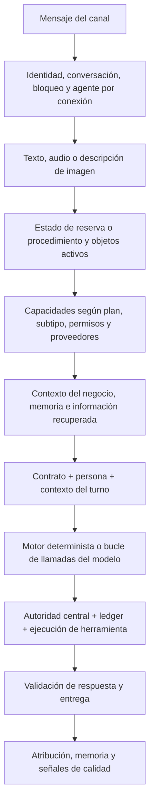
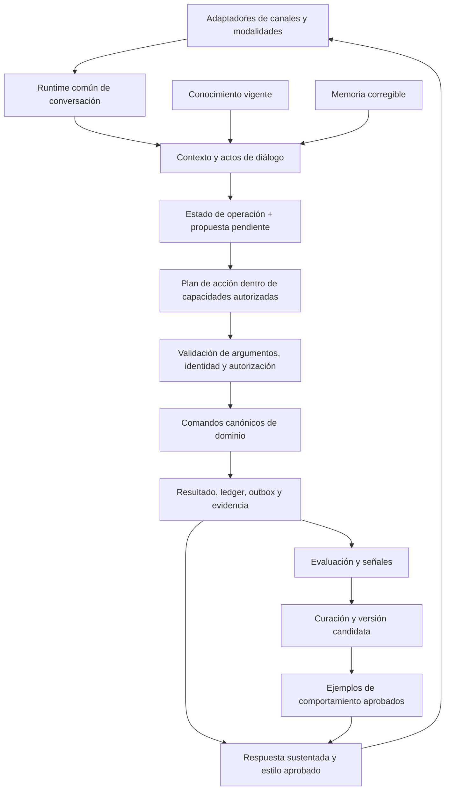

# Operación, competencia y aprendizaje del agente de Parallly

Ampliación del análisis del 5 de septiembre de 2026. Checkout `b1e87c71`. Complementa `docs/assist-agent-experience-audit-2026-09-05.md` y modifica el orden de implementación: la confiabilidad del runtime pasa a formar parte del camino crítico de la configuración asistida.

La ejecución posterior, sus commits, pruebas y frentes pendientes se mantienen en [Registro de implementación](agent-platform-implementation-progress.md). Este documento conserva el diagnóstico inicial; los avances no convierten la cobertura declarada en certificación por perfil, idioma o canal.

El registro y la corrección de mascotas amplían C/E/G/H con comandos atómicos, escenarios por perfil y evidencia de ficha/recibo. Su implementación y los límites pendientes de consentimiento declarativo, privacidad clínica y piloto se detallan en [Auditoría de mascotas](audits/2026-09-07/pet-command-lifecycle.md).

E2 ya integra identidad, horarios, región, plantilla multilingüe y política de exposición como contexto capturado en el núcleo de evaluación. El manifiesto integral sigue vigente; catálogo/RAG, proveedores y tráfico concurrente todavía limitan la reproducibilidad completa. Evidencia y siguientes pasos en [Captura de contexto del núcleo](audits/2026-09-07/evaluation-core-context-capture.md).

Las colecciones completas de FAQs y políticas ya están integradas en los lectores del runtime, conservando búsqueda PostgreSQL e invalidación global. Corrige ranking y desempate de FAQs; no completa todavía RAG ni catálogo. Pruebas y límites en [Captura de conocimiento estructurado](audits/2026-09-07/evaluation-structured-knowledge-capture.md).

Los escenarios canónicos y comandos de agenda en evaluación ya usan los horarios efectivos capturados y exigen una zona válida bajo lease, sin volver a la región pública del tenant. El reloj global sigue vivo. Evidencia en [Contexto temporal de evaluación](audits/2026-09-07/evaluation-temporal-context.md).

La réplica relacional de RAG y su opción interna de lectura ya tienen evidencia con PostgreSQL/pgvector; sus consumidores todavía no la crean ni seleccionan automáticamente. La siguiente integración, todavía pendiente de validación, incluye ciclo de vida, presupuesto, slots/referencias de uso, snapshot y retiro de fuentes. Alcance exacto en [Réplica de conocimiento](audits/2026-09-07/evaluation-knowledge-replica.md).

Aprendizaje desde Inbox y durante el runtime ya liga mensajes/versiones exactos, valida fuentes antes y después de cada intento de proveedor, controla workers por CAS y retira copias temporales con recuperación. Simulation Replay también conserva autorización evaluativa, fuentes/baselines y leases de copias; el fence compartido de fuente evita abrir una segunda transacción anidada detrás de un borrado. Estas guardas no repiten writers ni convierten una respuesta declarada exitosa en prueba operacional. Evidencia en [Fuentes de aprendizaje](audits/2026-09-07/learning-runtime-source-authority.md), [Retención del evaluador](audits/2026-09-07/learning-evaluation-retention.md) y [Replay autorizado](audits/2026-09-07/simulation-replay-source-authority.md).

La consolidación automotriz y los comandos de mascotas amplían las familias canónicas verificadas en PostgreSQL. Sus packs y lectores no acreditan todavía conversaciones completas con un modelo, identidad real por OTP ni entrega del proveedor. Permanecen en el plan E3 la publicación HTTP, promoción/piloto/rollback integral, y las demás fronteras de efectos y despacho diferido; también la evaluación bajo tráfico, los usuarios nuevos y los pilotos externos. El diagnóstico que sigue corresponde a la base inicial indicada arriba, no a una nueva auditoría del estado posterior a esas correcciones.

## Dictamen

Parallly tiene una arquitectura con piezas valiosas para construir agentes competentes: contexto por turno, persona por conexión, conocimiento híbrido, contratos efectivos de capacidades, autorización central, ledger de herramientas, objetos operativos activos, motores de reservas y procedimientos, y mecanismos de evaluación. **La principal brecha es la coherencia entre esas piezas a lo largo de una tarea completa.**

Una plantilla bien configurada puede encontrarse con un canal que no ejecuta herramientas, una interpretación de cortesía como consentimiento, una escritura que no aplica la política de anticipo o una operación que no puede completarse tras un error parcial. Aprender un tono más agradable no corrige esos problemas.

La dirección recomendada es un agente con **un runtime común, operaciones de negocio canónicas, conocimiento con procedencia, memoria corregible y aprendizaje curado**. Su competencia se demuestra mediante tareas completas: comprender, consultar, decidir, actuar con autorización, verificar, explicar, corregir y escalar cuando corresponda.

La auditoría ejecutó funciones/clases reales con dependencias simuladas. No utilizó un tenant vivo, proveedores, DB, cobros ni LLM reales. Los defectos reproducidos prueban caminos de código, no su frecuencia en producción. Se inspeccionaron familias representativas; este documento no certifica todas las herramientas o verticales de extremo a extremo.

## 1. Cómo opera actualmente

### Ruta principal de mensajería



`ConversationsService` concentra la coordinación. `getPersonaForChannel` resuelve el agente por conexión. La entrada admite texto, audio e imágenes mediante procesamiento previo; otros tipos reciben una explicación de alcance (`conversations.service.ts:1856`). `PromptAssemblerService` separa contrato, persona y contexto. El resolver de capacidades cruza herramientas configuradas con subtipo, plan, subpermisos, preparación y sistema externo propietario de los datos.

Hay varios caminos para ejecutar: BookingEngine, ProcedureEngine y el loop del LLM. Se han centralizado controles importantes, pero permanece lógica de negocio dentro de `AIToolExecutorService`, además de los servicios canónicos de dominio. El ledger reduce duplicados; no vuelve atómicas por sí mismo las operaciones de varias tablas.

### Caminos que hoy divergen

| Superficie | Ruta actual | Límite relevante |
|---|---|---|
| Mensajería principal | Orquestación completa + motores + herramientas | Existen problemas de interpretación, política y atomicidad descritos abajo |
| Web Chat | `WidgetGateway` → `streamWidgetMessage` | Ruta de streaming sin el loop de herramientas ni el mismo grounding/validación |
| Agent Test | Servicio separado, lecturas permitidas, writers restringidos en eval | No reproduce todas las etapas del runtime productivo |
| Simulación | Agent Test con `disableTools:true` | Evalúa conversación; no certifica operaciones completas |
| Evals con efectos | Subconjunto auditado de writers y sandbox alternativo | Cobertura positiva y paridad incompletas, ya documentadas en el primer informe |

El mismo nombre y prompt de agente no aseguran la misma competencia entre estas superficies. El canal debe variar transporte, formato y permisos específicos; la decisión y ejecución de negocio deben compartir el mismo núcleo.

### Qué está realmente avanzado

- Contratos de capacidades efectivas y autoridad de ejecución; una herramienta no obtiene permiso únicamente porque el modelo la mencione.
- Restricciones por subtipo, permisos y ownership del sistema externo; evita presentar una escritura local como actualización de un proveedor que controla ese dato.
- Ledger, controles de confirmación, manejo de acciones pendientes y verificadores de efectos auditados.
- Objetos activos para recuperar operaciones y referencias de pago opacas ligadas al contacto en varias familias.
- Búsqueda híbrida vectorial/textual, fusión de resultados, reranker opcional, versiones de documentos y recrawl.
- Memoria por contacto/perfil, router con fallback, afinidad por tarea y protección ante proveedores degradados.
- Simulaciones con comparación contra baseline y señales de producción. Son bases que deben reforzarse, no capacidades inexistentes.

El inventario ejecutado contiene 119 herramientas estáticas en 26 familias. Que el registro declare todos sus controles no demuestra que los 119 recorridos operativos estén completos: los defectos de dominio siguientes existen aun con ese registro consistente.

## 2. Hallazgos operativos prioritarios

P1 requiere corrección antes de presentar el agente como autónomo y confiable en el flujo afectado. P2 afecta competencia, cobertura o recuperabilidad. “Reproducido” implica código real con fixtures; cuando el ejecutor externo fue simulado, se declara explícitamente.

### R01 · P1 · Una pregunta sobre precio puede autorizar una reserva

En el estado de confirmación, **“Gracias, quiero saber primero el precio”** se normaliza como `acknowledge/high`; `authorizesEffect(..., transactional)` lo acepta. `IntentInterpreter` marca confirmación y BookingEngine intenta `create_appointment`.

La reproducción también ejecutó el verificador central `resolveBookingAuthorityEvidence`, que devuelve permitido con evidencia `text_confirmation`. El ejecutor final y los almacenamientos fueron simulados: no se creó una cita real.

Evidencia: `packages/shared/src/country-language-pack.ts`; `apps/api/src/modules/conversations/intent-interpreter.service.ts:131`; `tool-execution-control.service.ts:1598`; `booking-engine.service.ts:1048`.

El intérprete también convierte “Hola quiero cita mañana” en saludo sin extraer la fecha, y “¿Qué servicios no ofrecen?” en cancelación de la reserva en curso (`intent-interpreter.service.ts:144`, `:154`).

**Cambio:** identificar varios actos en el mismo mensaje: saludo/cortesía, pregunta, dato, modificación y consentimiento. Una pregunta, condición o cambio pendiente impide tomar una cortesía como autorización. El consentimiento debe responder a una propuesta concreta e íntegra, con acción, argumentos, importe cuando aplique, versión y caducidad. El modelo puede interpretar; la autoridad conserva la decisión verificable.

### R02 · P1 · La cita del agente puede omitir el anticipo configurado

`AIToolExecutorService.createAppointment` consulta el servicio sin campos de política de pago (`:3034`) e inserta `status='confirmed'` (`:3143`). No escribe `amount_due` ni `hold_expires_at`; devuelve confirmado y sin referencia pagable (`:3214`).

El servicio canónico de citas sí resuelve la política y crea `pending_payment` cuando corresponde (`apps/api/src/modules/appointments/appointments.service.ts:351`, `:364`, `:410`). BookingEngine usa la herramienta (`booking-engine.service.ts:1048`), por lo que la divergencia afecta también ese camino.

Reproducción: servicio de 100.000 con anticipo del 30% → la herramienta devuelve confirmado, sin hold ni importe pendiente. Es una ejecución aislada de la ruta, sin movimiento de dinero.

**Cambio:** herramienta, motor, dashboard y reserva pública deben invocar el mismo comando de dominio. La salida debe expresar `awaiting_payment`, importe canónico, vencimiento, opciones autorizadas y referencia opaca; solo un settlement confirmado debe producir la confirmación correspondiente. No copiar la regla de anticipo en otro prompt o handler.

### R03 · P1 · Web Chat no tiene la competencia del agente de mensajería

`widget.gateway.ts:323` llama a `streamWidgetMessage`; este ejecuta `executeStream(task:'conversation')` sin tools (`conversations.service.ts:4836`). Su contexto no ejecuta el mismo RAG/motores/composer y el texto se entrega por streaming sin los mismos guardrails de salida.

Reproducción: un modelo simulado responde “Tu cita quedó confirmada para mañana”; la ruta lo entrega con citas configuradas pero sin ninguna llamada de herramienta. Esto demuestra ausencia del control en esa ruta, no una alucinación medida de un modelo real.

**Cambio:** streaming como adaptador de entrega del runtime común. Emitir progreso permitido mientras trabaja; las afirmaciones finales de operación deben esperar un resultado verificado. Certificar explícitamente cada canal y modalidad.

### R04 · P1 · El modo borrador se aplica después de posibles efectos

`runTurn` llama primero a `generateResponse` (`conversations.service.ts:898`) y solo después revisa `behavior.draftMode` (`:945`). Dentro de generación ya pueden ejecutarse motores/writers y entregarse medios u otros efectos. El comentario dice que el cliente no recibe nada hasta aprobar, pero la condición controla la respuesta final, no el conjunto de efectos.

**Cambio:** definir un modo de ejecución antes de actuar: propuesta sin efectos, acción aprobada o ejecución autónoma permitida. Las herramientas producen propuestas en modo borrador. Una aprobación debe comprometer la propuesta vigente y sus efectos, no solo enviar un texto ya redactado.

### R05 · P1/P2 · Los procedimientos no entienden interrupciones y validan insuficientemente los datos

`ProcedureEngine.process` asigna el mensaje completo al `awaitingField` y avanza (`procedure-engine.service.ts:259`). En la reproducción, “¿Por qué necesitan mi correo?”, “Ya no quiero continuar” y “prefiero hacerlo después” se guardan como email y el procedimiento termina como completo.

**Cambio:** slots tipados con validación y procedencia; preguntar, corregir, pausar, cancelar y retomar son eventos propios. Un rechazo o una consulta no puede completar un campo. Reutilizar la capa de diálogo y estado operativo del runtime, preservando el contenido recogido.

### R06 · P1/P2 · Hay herramientas que no cierran el recorrido que anuncian

| Caso | Evidencia actual | Corrección |
|---|---|---|
| Clase llena | `gyms-tools.ts:44` promete waitlist; `gyms.service.ts:504` rechaza antes de llegar a ella (`:546`). Reproducido: `Class is full` | Un solo comando que resuelva plaza o lista de espera y devuelva estado distinto |
| Cancelar clase de otra conversación | `cancel_class_booking` exige bookingId; no se ofrece un lector de reservas propias equivalente. Membresía/horario no sustituyen la reserva | Consultar operaciones propias y seleccionar una referencia opaca antes de cancelar |
| Cancelar matrícula | `ai-tool-executor.service.ts:5926` modifica matrícula y devuelve cupo en pasos separados | Transacción + transición condicionada; un retry debe recuperar o devolver el resultado previo |
| MCP aprobado | Preflight valida aprobación pero conserva política opaca incompleta (`tool-execution-control.service.ts:905`) | Política ejecutable específica y auditada por herramienta; mientras falte, capacidad pendiente explícita |

Cancelación reproducida: la matrícula queda `dropped`, falla la devolución del cupo y el retry rechaza el estado sin repararlo. También hay riesgo de devolución duplicada ante dos operaciones concurrentes si la transición no está condicionada. El ledger de conversación no sustituye el control del recurso de negocio entre canales.

### R07 · P2 · Elegir herramientas relevantes no asegura una cadena completa

El selector puede conservar una escritora y omitir el lector que su contrato exige. En un contraejemplo aislado con 31 candidatos, conserva `book_class` y pierde `get_my_membership`. **Esta prueba es del selector sobre un registro configurado, no una ejecución completa del composer de un tenant concreto.**

Producción elige el conjunto antes del loop y lo reutiliza (`conversations.service.ts:2895`, `:3204`). Hace falta comprobar cierre de dependencias y disponibilidad después de cada resultado: consultar objeto → obtener identificador → comprobar precondición → proponer → ejecutar → verificar.

**Cambio:** registro de capacidades con lectores requeridos, writers, verificadores, precondiciones y rutas de recuperación. Selección por intención y estado, no solo similitud de nombres/descripciones. Mantener acotado el conjunto visible y ampliarlo cuando la operación lo necesita.

### R08 · P1/P2 · El conocimiento pierde condiciones y algunas rutas aplican otra política

`KnowledgeService.searchRelevant` selecciona metadatos de regulación, autoridad, jurisdicción y vigencia, pero los elimina en el mapeo final (`knowledge.service.ts:713`, `:781`). El consumidor intenta leerlos (`conversations.service.ts:2980`); llegan ausentes. Reproducción: metadatos presentes en fila → no preservados en resultado.

El gate regulado depende además de `is_regulated`, cuyo default es falso, sin un flujo completo de ingesta/edición que permita gestionar ese alcance. No hay que asumir autoridad de una fuente solo por haberla cargado.

La herramienta `search_knowledge_base` no transmite la misma política de idioma, umbral y reranking del RAG automático. Reproducción: candidato de score 0,08 se presenta como resultado utilizable bajo defaults del camino de herramienta. Es una divergencia de política; los umbrales finales deben calibrarse para cada modo de búsqueda.

**Cambio:** un servicio de recuperación compartido por contexto automático, herramientas, revisión y evaluación. Devuelve contenido más procedencia, estado de disponibilidad, versión, vigencia y alcance. Alcance por agente/audiencia configurable: hoy compartir por tenant no es una fuga entre tenants, pero no permite separar con precisión conocimiento operativo, ventas o material interno cuando el negocio lo necesita.

La detección de contradicciones existente es parcial: muestrea documentos, no contrasta todas las fuentes estructuradas, y sus issues no retiran automáticamente las fuentes de retrieval (`kb-health.service.ts:21`, `:156`). Hay que presentar conflicto/desconocido y definir precedencia, sin hacer equivalentes “no encontré contradicción” y “la fuente está verificada”.

### R09 · P1/P2 · Una cifra escrita por el cliente puede pasar como precio respaldado

El corpus que usa la validación de precios incluye historial y mensaje entrante (`conversations.service.ts:4191`). Reproducción con validador real: catálogo COP 20.000 + cliente proponiendo COP 1.000 → “El precio es COP 1.000” pasa. Sin esa propuesta del cliente, falla.

**Cambio:** distinguir hechos autorizados, afirmaciones del cliente, estimaciones y ejemplos. Un precio, disponibilidad, descuento o confirmación debe respaldarse en la fuente o resultado autorizado para ese campo. La coincidencia de una cifra dentro del contexto no acredita su autoridad.

### R10 · P2 · Memoria y conocimiento necesitan actualización y borrado consistentes

- La memoria resumida y la memoria semántica son capas distintas. Una corrección del extractor puede no eliminar la afirmación anterior de la segunda; la reproducción reintroduce un dato obsoleto al recuperar sin embeddings.
- El borrado de datos del contacto no elimina `customer_memories`/`customer_memory_facts`; estas tablas no dependen de una cascada de FK (`compliance.service.ts:182`, `customer-memory.service.ts:46`). Se reprodujo el camino de borrado sin comandos sobre esas memorias.
- Una actualización de fuente elimina embeddings anteriores antes de terminar su reemplazo; un error de generación puede dejar la fuente sin versión recuperable.
- El backend de gaps devuelve `lowSatisfactionDocs`, `staleDocuments`, `falsePositiveCounts`; la UI espera otros nombres (`knowledge.service.ts:1722`, `admin/knowledge/page.tsx:1157`). Tres clases de falencias quedan invisibles.

**Cambio:** hechos con ID, evidencia, vigencia y estado superseded/retracted; actualización de fuente en staging con cambio atómico de versión vigente; linaje de derivados para corregir/borrar índices, memoria, ejemplos y datasets; contrato compartido para diagnósticos visibles.

### R11 · P2 · Las pruebas actuales todavía pueden comparar algo distinto de lo anunciado

Se reprodujeron cuatro comportamientos en `SimulationService`:

1. Se selecciona `web_widget`, pero `runScenario` no transmite `channelType` a Agent Test (`:503`), que usa su default. El selector no prueba la ruta del canal elegido.
2. Se almacena snapshot/version al inicio (`:231`, `:261`), pero cada turno vuelve a leer el agente vivo mediante Agent Test (`agent-test.service.ts:124`). Una edición durante el run puede mezclar versiones bajo un snapshot inicial.
3. Si el modelo que simula al cliente falla, se convierte en `[FIN]` (`simulation.service.ts:598`), indistinguible del cierre voluntario a esa altura del runner.
4. Si un escenario antes exitoso ahora falla técnicamente, se reporta `failed:1` pero `baseline.hasRegression:false`, porque la comparación recorre solo los resultados con nota (`:612`, `:663`). No se oculta el conteo de error; el indicador de regresión es incompleto.

Además todas las simulaciones deshabilitan tools; replay usa las primeras entradas de clientes de conversaciones recientes, sin seleccionar calidad, idioma real o agente (`:325`). Hay comparación de baseline: hay que hacerla reproducible y ampliar sus criterios, no construir otra desde cero.

**Cambio:** revisión inmutable por run; mismo runtime y canal con adaptadores de prueba; errores y escenarios ausentes afectan el gate de regresión; distinguir simulador fallido de conversación terminada. Replay de mensajes fijos y cliente simulado controlado son técnicas complementarias, ambas con límites visibles.

### R12 · P2 · “Aprender de chats” todavía no existe como aprendizaje curado

La memoria actual aprende hechos del cliente. El replay toma mensajes inbound para probar respuestas nuevas. Ninguno selecciona buenas respuestas históricas, extrae estilo aprobado ni publica una versión de comportamiento aprendida.

Hay señales de QA y conocimiento; `WatchtowerService` adicional es un placeholder que cuenta muestras y deja pendiente conectar el juez/alertas (`simulation/watchtower.service.ts:34`). Esto no significa que toda la QA de producción esté ausente: los listeners de calidad existentes sí operan.

**Cambio:** el ciclo de aprendizaje descrito en la sección 5, utilizando las señales reales y ampliando la evaluación existente.

### R13 · P1/P2 · Prometer seguimiento o transferencia no siempre crea ese resultado

Algunas ramas de handoff capturan el fallo de transferencia y conservan la respuesta final (`conversations.service.ts:3537`, `:3569`). El fallback de afirmación no verificada también promete revisar y volver después sin crear allí una tarea de seguimiento (`:257`). Son caminos de código revisados; no se simularon todas las rutas de entrega externa.

**Cambio:** el resultado de handoff y de cualquier seguimiento debe ser explícito. Si la derivación no se creó, comunicar que sigue pendiente y ofrecer el próximo paso real. Crear y verificar una tarea antes de prometer contacto posterior. Incluir recepción por el equipo, contexto y recuperación de fallos dentro del escenario completo.

## 3. Qué significa ser competente en tareas completas

La unidad de producto debe ser la **capacidad de terminar y recuperar una tarea**, con resultado verificable. La existencia de un handler es solo una parte.

| Escenario | Recorrido completo exigido | Estado de esta revisión |
|---|---|---|
| Consulta de información | Comprender → fuente vigente → respuesta sustentada → aclaración/corrección | RAG avanzado; corregir procedencia, umbrales y autoridad |
| Clínica con anticipo | Servicio/profesional → disponibilidad → propuesta → aceptación → pago → confirmación → cambio/cancelación | Bloqueos reproducidos de consentimiento y política de anticipo |
| Retail | Necesidad → SKU/variantes → stock → precio autorizado → pedido → pago → seguimiento/cancelación | Existen componentes; certificar recorrido y recuperación, sin asumir cobertura total |
| Restaurante | Preferencias → menú/condiciones → cantidades → modalidad → pedido → estado → modificación | Existen componentes; validar información sensible del menú y efectos/errores |
| Gimnasio | Membresía/créditos → clase/cupo → reserva o waitlist → cancelar/promover/restituir | Fallos de waitlist y descubrimiento de reserva; atomicidad pendiente de certificar |
| Educación | Requisitos → curso/cohorte → matrícula → pago → retiro/devolución de cupo | Cancelación con error parcial reproducida |
| Taller | Recoger síntomas sin inventar diagnóstico → solicitud/orden → presupuesto/aprobación → seguimiento | Herramientas existentes; cerrar verificador de evaluación y casos positivos |
| Alojamiento o alquiler | Recurso y fechas → disponibilidad del sistema propietario → condiciones → retención/reserva/pago → cambio | Mantener límites de proveedor y distinguir solicitud de reserva confirmada |
| Seguro | Identificar caso → verificar identidad → documentación → operación permitida → seguimiento humano | Límites de identidad son parte de la competencia; no forzar writers pendientes |
| Conversación real cambiante | Saludo con intención → dos consultas → interrupción → cambio → retomar → humano | Defectos reproducidos de intención/slots; estado común necesario |

Para cada uno deben existir también: usuario que corrige un dato, “sí, pero…”, proveedor caído, timeout después de una escritura, webhook tardío/duplicado, mensaje repetido, sesión retomada, agente distinto, concurrencia por último cupo, agotamiento de presupuesto y derivación sin perder contexto. Medir éxito sobre intentos elegibles, no solo conversaciones que ya se consideran resueltas.

Audio e imágenes requieren pruebas del significado extraído antes de acciones. Una transcripción o descripción visual es una observación potencialmente incierta; no equivale a precio canónico, identidad verificada ni autorización de pago. Los tipos de archivo no soportados deben producir una alternativa útil.

## 4. Arquitectura objetivo

Mantener el monorepo, NestJS, servicios de dominio, PostgreSQL, Redis y BullMQ. Separar responsabilidades dentro del producto y migrar rutas gradualmente. No se necesita introducir varios agentes autónomos para cada turno.



### Contratos necesarios

| Contrato | Contenido mínimo y responsabilidad |
|---|---|
| `AgentRelease` | Misión, configuración, herramientas/contratos, fuentes autorizadas, ejemplos, modelo/política y fingerprints inmutables |
| `ConversationState` | Revisión, época, agente/release, objetivos activos, slots con procedencia, pregunta/propuesta pendiente y operaciones recientes |
| `DialogueAct` | Pregunta, datos aportados, corrección, aceptación, rechazo, pausa y cambio de objetivo; puede haber varios en un mensaje |
| `OperationProposal` | Acción exacta, recurso, argumentos, condiciones, importe canónico cuando aplique, revisión, caducidad y evidencia de consentimiento |
| `CapabilityContract` | Lectores, writers, requisitos, permisos, idempotencia, verificadores, compensación, restricciones de canal/proveedor y pruebas |
| `OperationResult` | Succeeded/pending/rejected/failed/uncertain, entidad/referencia, versión, hechos autorizados, siguiente paso y reconciliación |
| `GroundedContext` | Fuentes y campos con procedencia, autoridad, vigencia, scope y disponibilidad; datos del cliente separados de datos del negocio |
| `LearningRelease` | Ejemplos y reglas aprobados, linaje, rúbrica, datasets, evaluación comparada, aprobación y política de retiro |

Estas estructuras deben extender los contratos existentes; no añadir otros mapas incompatibles de tools/verticales. El modelo selecciona un siguiente paso dentro de límites. El backend valida, ejecuta y confirma la transición de negocio. La redacción utiliza hechos confirmados y explica estados pendientes con naturalidad.

### Estado, entrega y recuperación

Una operación debe poder pausarse mientras el agente responde una pregunta y retomarse sin pedir todo otra vez. Las confirmaciones se invalidan si cambia recurso, precio, fecha u otra condición material. La época separa sesiones; una confirmación antigua no autoriza una propuesta nueva.

Mutaciones de un mismo recurso deben ser atómicas y condicionadas a versión/estado, incluso entre conversaciones y canales. Usar los outbox existentes cuando correspondan para entregar eventos después del commit. Si un proveedor devuelve timeout, registrar estado incierto, consultar por referencia y reconciliar antes de reintentar. La cancelación debe describir efectos reales sobre cupo, cobro y política, sin asumir que todos son reversibles.

La respuesta debe ser coherente con el commit: “te guardé la solicitud”, “falta el anticipo”, “quedaste en lista de espera” y “tu reserva está confirmada” representan estados distintos. Su presentación puede ser breve y natural; la evidencia operativa permanece visible para diagnóstico.

### Modelo, contexto y costo

Evaluar modelos por comprensión, argumentos, multi-turn, grounding y estilo sobre tareas propias. El router actual ya distingue conversación y tools; ampliar el criterio con dificultad, riesgo y capacidad probada. No convertir falta de presupuesto en menor rigor de autorización o veracidad. Un modo degradado puede consultar, explicar límites o escalar cuando no puede completar la operación.

Planificar, ejecutar y redactar son responsabilidades separadas, pero no implican tres llamadas de modelo en cada turno. Aprovechar rutas deterministas para transiciones claras, contexto limitado por utilidad y recuperación de fuentes/ejemplos según necesidad. El presupuesto se mide por resultado útil, incluyendo retries y evaluaciones.

## 5. Aprender de chats escogiendo lo mejor

### Separar lo que se aprende

| Material del chat | Destino | Regla |
|---|---|---|
| Preferencia/dato del cliente | Memoria individual | Evidencia, actualización, alcance y borrado; no se comparte como conocimiento del negocio |
| Hecho del negocio mencionado por una persona | Candidato a conocimiento | Validar contra fuente/propietario antes de publicarlo |
| Buena forma de responder | Biblioteca de ejemplos | Seleccionar fragmento, abstraer datos variables y revisar que sea seguro/coherente |
| Secuencia que resolvió una tarea | Ejemplo operativo y escenario | Conservar estados, permisos y resultados que la hicieron válida |
| Error o mala conversación | Dataset de regresión | Usarla para comprobar mejoras, sin enseñarla como conducta deseada |

Una venta lograda no vuelve excelente todo el chat. Un tono amable no compensa un precio inventado. Una negativa correcta, una buena aclaración o una derivación útil también pueden ser ejemplos excelentes.

### Flujo de ingesta y selección

1. **Importar** conversaciones del inbox o archivos soportados, con mapeo de roles, idioma, canal, fechas y origen. Registrar qué información operativa existe; los chats externos sin evidencia no se tratan como éxitos verificados.
2. **Normalizar y depurar** duplicados, mensajes internos y datos innecesarios. Mantener la relación con la fuente para corregir o retirar derivados. El contenido importado se trata como datos no confiables, no como instrucciones del sistema.
3. **Segmentar** por tarea y momentos útiles: descubrimiento, explicación, objeción, confirmación, error, recuperación y cierre. Una parte buena puede seleccionarse aunque el resto del chat no sea ejemplar.
4. **Aplicar exclusiones antes de puntuar:** hechos falsos/no sustentados, promesas sin efecto, consentimiento incorrecto, incumplimiento de política, datos privados de terceros o instrucciones inyectadas no pueden ganar por tono o conversión.
5. **Evaluar dimensiones separadas:** logro verificable, precisión, uso de herramientas, comprensión, claridad, brevedad, empatía, tono de marca, manejo de incertidumbre y calidad de cierre/handoff. El juez automático propone; calibrar contra revisores humanos del negocio.
6. **Seleccionar diversidad:** intención, dificultad, negocio/subtipo, canal, idioma, estado emocional y tipo de resultado. Evitar que miles de saludos fáciles dominen la selección. Deduplicar paráfrasis y conservar ejemplos con desacuerdo para revisión.
7. **Revisar y aprobar** ejemplos con explicación de qué se aprende y qué datos se parametrizaron. Mostrar original, versión saneada, patrón propuesto y evidencia del resultado. Una corrección del ejemplo crea una nueva revisión.
8. **Evaluar una versión candidata** con conjunto reservado, comparación ciega de estilo y pruebas operativas. Promover solo si mejora la dimensión buscada sin degradar capacidades críticas.
9. **Publicar gradualmente y observar**, con retiro de ejemplos o regreso a la versión anterior si empeoran los resultados.

No usar `was_used` del retrieval como certificación del ejemplo: actualmente representa score suficiente antes de responder (`knowledge.service.ts:872`), no evidencia de que una frase se sustentó en la fuente. Tampoco reutilizar como cuarentena los recursos legacy cuyo `getResources` autoaprueba drafts (`knowledge.service.ts:1512`); la biblioteca curada necesita estados explícitos y separados.

### Cómo usar los ejemplos durante la conversación

Empezar con ejemplos seleccionados en contexto y una guía de estilo corta. Recuperar un pequeño conjunto pertinente por misión, idioma, intención y estado; el número y presupuesto se calibran en pruebas. No insertar historiales completos en cada turno ni recuperar ejemplos de otro tenant.

Cada ejemplo separa: situación, hechos disponibles, acciones permitidas/realizadas, respuesta modelo y motivo de calidad. Los valores variables son placeholders; los hechos actuales vienen de las fuentes y herramientas del tenant. Los ejemplos no pueden anular contratos, políticas o consentimiento.

Ejemplo de patrón aprobado: ante un cambio de cita, reconocer la solicitud, recuperar la cita correcta y preguntar únicamente el dato faltante. “Puedo ayudarte a cambiarla. Tengo tu cita de [fecha/hora verificadas]. ¿Qué día te sirve?”. La frase solo es válida si la cita fue recuperada y corresponde al cliente.

El comportamiento de marca debe declarar trato, formalidad, vocabulario, extensión, emojis, ritmo, empatía y manejo de objeciones. Debe adaptarse a contexto: una queja o urgencia requiere una respuesta distinta a una consulta comercial. Preservar la voz sin copiar nombres, ofertas antiguas o muletillas de cada operador.

El entrenamiento de pesos puede considerarse después, si existe volumen curado y una mejora demostrable frente a esta base. No debe usarse para memorizar precios, políticas cambiantes, disponibilidad o información privada.

### Evitar aprender y evaluarse con lo mismo

Separar desarrollo, validación y conjunto reservado por conversación, contacto/origen y periodo; revisar duplicados y paráfrasis entre grupos. Congelar versiones de fuentes, ejemplos, modelo, rúbrica y fixtures. Evaluar varios intentos de tareas críticas y registrar variabilidad.

Las métricas de selección deben incluir fallos, abandonos y casos difíciles. No promover una versión porque subió el promedio al excluir los escenarios que fallaron. Conservar ejemplos de buenas negativas y recuperación, y un dataset aparte de errores conocidos.

El retiro de una fuente debe invalidar los ejemplos dependientes cuando su verdad o permiso cambie. El borrado del contacto requiere propagar el borrado o anonimización acordada a memorias, embeddings, ejemplos, datasets y otros derivados identificables. Diseñar el linaje desde la ingesta.

La validación posterior del 7 de septiembre amplía este requisito a **cada salida externa y cada reintento**, incluidos embeddings, reranking y consultas de memoria con texto histórico. Una fuente retirada debe invalidar la evaluación aunque una capa de búsqueda normalmente tolere errores. La implementación y sus pruebas se detallan en [Fuentes en salidas externas](audits/2026-09-07/learning-external-source-authority.md). Continúan el presupuesto completo de esos intentos, el deadline por tarea, todas las trazas derivadas y la validación de mejora semántica; este avance no certifica por sí solo el aprendizaje.

## 6. Validación de competencia y naturalidad

Tres niveles deben compartir el runtime de dominio:

1. **Contratos deterministas:** argumentos, permisos, transiciones, atomicidad, fuente de precios, idempotencia y estado externo.
2. **Tareas completas:** fixtures reproducibles, usuario con datos suficientes/insuficientes, modificaciones, interrupciones y recuperación; resultado final verificado. Incluir canales/modos y casos concurrentes.
3. **Conversación y estilo:** comprensión, fluidez, precisión con evidencia, tono elegido y esfuerzo del cliente, revisados con rúbricas calibradas y comparación ciega.

Para tareas con acción, el éxito es resultado correcto + autorización correcta + comunicación fiel. Para información, es respuesta sustentada y útil o abstención/aclaración adecuada. Para handoff, es transferencia creada y recibida con contexto útil, además de la frase que la anuncia.

No exigir una secuencia de herramientas única si otra ruta autorizada logra el mismo resultado. Sí exigir precondiciones y estados finales. La redacción puede variar; importes, horarios, identidades y compromisos no pueden variar libremente.

Métricas: éxito por intención/capacidad; errores y duplicados; falsas confirmaciones; recuperación; solicitudes repetidas de datos; correcciones atendidas; número de turnos útiles; abandono; handoff apropiado; latencia P50/P95; costo por resultado; preferencia humana de estilo y precisión. Segmentar por vertical, idioma, canal y dificultad, con denominador y muestra visibles.

Criterio inicial propuesto para liberar pilotos: ninguna violación de consentimiento, pago, identidad o integridad en la batería crítica; todos los recorridos imprescindibles con caso positivo; regresiones técnicas consideradas bloqueantes; revisión humana de ejemplos; datos/fuentes/versiones identificables. Los umbrales estadísticos de éxito se fijan con una línea base real, no a partir de una promesa de mercado.

## 7. Plan integrado de implementación

Este orden actualiza la secuencia del primer informe. La mejora visual y Assist siguen dentro del alcance, pero dependen de que el mismo diagnóstico y los mismos comandos representen la operación real.

| Lote | Trabajo concreto | Dependencias / aceptación |
|---|---|---|
| **A. Integridad inmediata** | Consentimiento contextual; propuesta pendiente; anticipo de citas; borrador antes de efectos; cancelación matrícula atómica; dejar explícitas capacidades Web Chat/MCP no cubiertas | Convertir reproducciones en tests de aceptación. Cero escrituras ante consulta/rechazo; cita impaga no confirmada; retries recuperables |
| **B. Runtime compartido** | Extraer coordinación por turnos; mismo pipeline para canales, test y simulación; adaptadores de transporte/efectos; conservar ledger, autoridad y outbox | Una tarea ejecuta las mismas reglas en cada superficie; modo de prueba sin efectos externos |
| **C. Estado y operaciones** | Slots tipados, actos múltiples, pausa/retomar/cancelar; comandos canónicos por dominio; referencias a objetos propios; dependencias de tools | E2E de cita, pedido y matrícula/gimnasio, incluidos error parcial y concurrencia |
| **D. Conocimiento y memoria** | Retrieval común; procedencia, autoridad y scope; reemplazo de fuentes por versión; corrección/retiro de memoria; borrado de derivados; arreglar diagnósticos UI | Precio del cliente no valida precio del negocio; conocimiento fallido no borra versión vigente; correcciones no resucitan |
| **E. Pruebas y releases** | Packs positivos; verificador taller; snapshots inmutables; canal real; fallos en regresión; presupuesto/colas de evaluación; promoción y rollback | Candidato probado antes de desplazar versión vigente; métricas y cobertura fieles |
| **F. Assist y configuración** | Assessment/misión comunes del primer plan; acciones tipadas; cambio visible; verificación; tours como tareas; capacidades UI del registro real | “Ya quedó” respaldado por relectura/prueba; usuario sabe qué consigue y qué falta |
| **G. Aprendizaje curado** | Importar/segmentar chats; selección multidimensional; ejemplos aprobados; dataset reservado; recuperación contextual; versión candidata | Mejora de estilo demostrada sin degradación de verdad, acciones, límites o privacidad |
| **H. Expansión por vertical** | Matriz capacidad→tarea→datos→comando→verificador→canal; cobertura por familia/subtipo y benchmark | Publicar competencia comprobada por perfil, sin heredar certificación automáticamente |

**Primer lote de código recomendado:** A, con una clínica que agenda con anticipo, una cancelación con error/retry y un mensaje de confirmación condicionado. En paralelo pueden corregirse la veracidad/tours del primer informe y diseñarse los contratos B/D/E. No habilitar aprendizaje automático de ejemplos antes de resolver procedencia, borrado y evaluación de candidatos.

### Unidades técnicas revisables

| Unidad | Archivos/área de partida | Prueba que debe cambiar de resultado |
|---|---|---|
| A1 | `country-language-pack`, `intent-interpreter`, `tool-execution-control`, `booking-engine` | “Gracias, primero dime el precio” conserva propuesta y responde pregunta; no autoriza |
| A2 | `ai-tool-executor`, `appointments.service`, `payment-operation`, tenant-payments | Anticipo requerido produce pendiente + referencia; settlement confirma una vez |
| A3 | `conversations.service`, autoridad/ledger y draft console | En borrador no hay reserva, cobro, mensaje ni media externos antes de aprobación |
| A4 | Writers de matrícula y `gyms.service` | Error entre operaciones no pierde/duplica cupo; waitlist accesible y estado honesto |
| B1 | `conversations`, `widget.gateway`, `agent-test`, `simulation` | Misma tarea/misión/herramientas; diferencias solo por permisos y adaptador |
| D1 | `knowledge.service`, knowledge tools, assembler, response validator | Metadatos preservados y política de retrieval consistente |
| D2 | `customer-memory`, compliance, knowledge ingestion | Actualización/borrado llega a todos los derivados; rollback de indexación fallida |
| E1 | `simulation`, `eval`, contratos shared y release de persona | Misma revisión durante run; fallos sí invalidan baseline; acción positiva comprobada |
| G1 | Módulo nuevo de curación integrado con knowledge/quality/persona | Ejemplo aprobado mejora estilo; dato obsoleto o acción inválida impide promoción |

Las cifras de 6–10 semanas del primer informe correspondían al programa inicial de configuración/calidad. Esta ampliación añade consolidación del runtime y aprendizaje. Reestimar el programa tras cerrar A y definir tres flujos piloto de B–E; no sumar automáticamente estimaciones antiguas ni comprometer la certificación de todos los perfiles en ese mismo plazo.

## 8. Evidencia y límites

Scripts ejecutados desde la raíz, con clases/funciones actuales y dependencias aisladas:

```text
node docs/audits/2026-09-05/reproduce-runtime-orchestration.cjs
node docs/audits/2026-09-05/reproduce-agent-tool-competence.cjs
node docs/audits/2026-09-05/reproduce-knowledge-learning.cjs
node docs/audits/2026-09-05/reproduce-simulation-fidelity.cjs
```

Cada uno tiene JSON adjunto en esa carpeta. El caso de fecha de viernes es dependiente de la zona horaria del proceso: `new Date(fecha).getDay()` puede resolver sábado en America/Bogota (`intent-interpreter.service.ts:318`). Requiere normalización de fechas civiles en la zona del tenant; no se afirma que el VPS use esa zona.

También se ejecutaron suites focalizadas de simulación, controles, herramientas, conocimiento y prompt. Se agregan sus resultados al registro del primer informe sin interpretar aprobación de tests existentes como certificación de negocio. No se modificó producto ni se desplegó; se agregaron análisis, plan y evidencia reproducible.

| Grupo de pruebas de esta ampliación | Resultado |
|---|---|
| Booking/Procedures, widget, contrato prompt, escenarios y timeout | 6 suites / 39 pruebas pasan |
| Selector/políticas de herramientas y seguridad de citas | 3 suites / 28 pruebas pasan |
| Jurisdicción/retrieval, invariantes y escaping de persona | 4 suites / 33 pruebas pasan |
| Simulación, infraestructura eval y packs | 3 suites / 26 pruebas pasan |

Total de esta ampliación: 16 suites focalizadas / 126 pruebas. No sumar a las del primer informe como si fueran todas diferentes: algunas suites se repitieron. Las reproducciones adicionales documentan casos fuera de la cobertura actual. TypeScript API/dashboard y bootstrap habían pasado en la primera parte de esta misma auditoría; no hubo cambios de producto posteriores.

## 9. Referencias técnicas para las decisiones

- Curar contexto y ejemplos diversos, y gestionar memoria a lo largo de tareas, respalda un contexto pequeño y pertinente en lugar de acumular todo el historial. [Anthropic: Effective context engineering for AI agents](https://www.anthropic.com/engineering/effective-context-engineering-for-ai-agents).
- Diseñar herramientas con límites claros, respuestas útiles y evaluación de tareas respalda el contrato de capacidades y operaciones propuesto. [Anthropic: Writing effective tools for agents](https://www.anthropic.com/engineering/writing-tools-for-agents).
- Los ejemplos pueden orientar tono y estructura si son pertinentes, diversos y separados de las instrucciones. Se debe verificar el efecto en los modelos utilizados por Parallly, sin asumir transferencia perfecta. [Claude: Prompting best practices](https://platform.claude.com/docs/en/build-with-claude/prompt-engineering/claude-prompting-best-practices).
- La evaluación de un agente debe comprobar resultados y trazas además de respuestas. [Anthropic: Demystifying evals for AI agents](https://www.anthropic.com/engineering/demystifying-evals-for-ai-agents).

Estas fuentes orientan el diseño, no prueban el desempeño actual de Parallly. La meta práctica es competencia medible en los procesos que cada agente tiene asignados, con límites claros y mejora sostenida.
