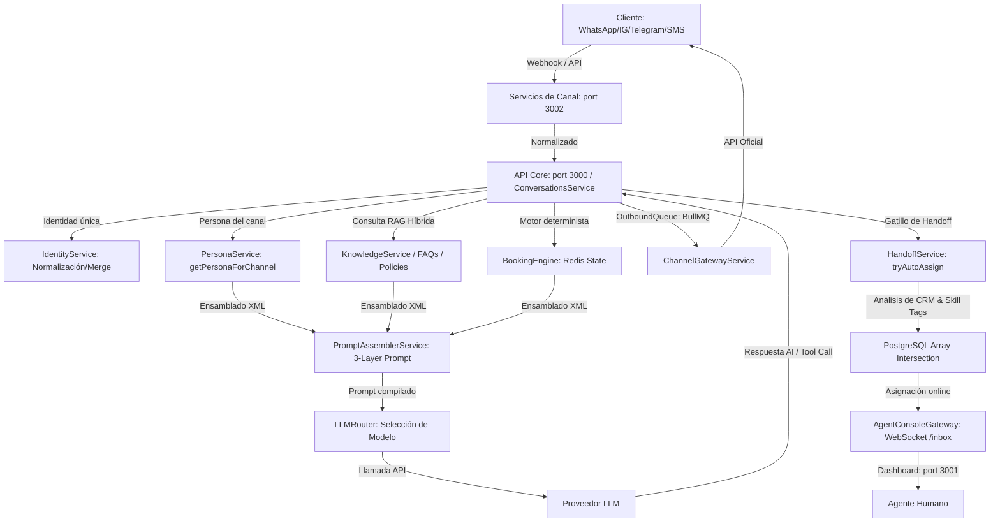
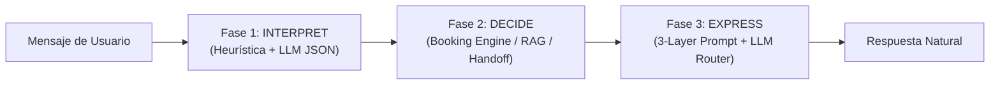

# Arquitectura del Motor de IA Conversacional — Parallext Engine

Referencia detallada de la arquitectura, flujos de datos y lógica interna del motor de IA de Parallext (Actualizado: Mayo 2026). Este documento detalla exhaustivamente el diseño de las capas de prompt, la arquitectura de conocimiento inteligente con RAG difuso, el paradigma del pipeline cognitivo, la inmunidad de zona horaria nativa y la orquestación del handoff dinámico basado en CRM.

---

## 1. Flujo Completo del Mensaje (End-to-End)

El procesamiento de interacciones se basa en un flujo desacoplado y tolerante a fallos:



### Protocolo de Flujo Técnico:
1. **Normalización del Mensaje**: Los adaptadores de canales reciben el payload oficial (Meta Cloud API, Telegram Bot API, etc.), validan firmas criptográficas (`meta-signature.util.ts`) e inyectan una clave de idempotencia en Redis (`idem:wa:{id}`) con un TTL de 24h para evitar el doble procesamiento ante reintentos de la red.
2. **Orquestación de la Conversación**: `ConversationsService` adquiere un Mutex distribuido en Redis (`lock:conv:{conversationId}`) durante 30 segundos. Resuelve la identidad unificada con `IdentityService` y carga el estado de reserva temporal de Redis (`booking:{conversationId}`).
3. **Filtro de RAG e Intentos**: Se ejecuta la búsqueda de FAQs, políticas activas y RAG híbrido (Coseno Vectorial + ILIKE). Si no hay un flujo de reserva activo, se alimenta la IA.
4. **Ensamblado del Prompt y LLM**: `PromptAssemblerService` compila dinámicamente las capas en un prompt de sistema jerárquico.
5. **Cola de Salida**: Las respuestas se encolan en BullMQ (`outbound-messages`) con políticas de reintento exponencial para respetar los límites de la API del canal.

---

## 2. Paradigma del Pipeline de Tres Fases (INTERPRET -> DECIDE -> EXPRESS)

El motor de IA conversacional de Parallext procesa las interacciones utilizando un pipeline cognitivo estructurado en tres fases secuenciales para garantizar robustez, velocidad y exactitud en la comunicación:



### Fase 1: INTERPRET (Detección de Intenciones e Idioma)
- **LanguageDetectorService**: Detecta el idioma del cliente (`es` | `en` | `pt` | `fr`) analizando stop-words en tiempo récord (heurística local ligera, evitando costes de APIs externas). Exige una confianza mínima (el ganador debe superar al segundo lugar por al menos 2 puntos y tener un score $\ge$ 2); en caso contrario, utiliza el idioma configurado por defecto para el canal del agente.
- **IntentInterpreterService**: Extrae la intención estructurada (`InterpretedIntent`) y variables clave (nombre, email, fecha, hora, selección de servicio, confirmación o negación).
  - *Extracción Determinista (Fórmula del 80%)*: Para optimizar latencia y costos, un motor regex e indexador semántico local extrae intenciones comunes como saludos, despedidas, confirmaciones cortas ("sí", "dale"), negaciones ("no", "cancelar"), y selecciones numéricas de servicio en turnos de agendamiento.
  - *Extracción Cognitiva por LLM*: Si la heurística no tiene alta certeza, delega a un modelo de lenguaje ligero configurado con salida forzada en JSON, abstrayéndose de la personalidad e inyectando solo el contexto inmediato del usuario.

### Fase 2: DECIDE (Determinación del Estado de Negocio)
El backend procesa la intención interpretada para decidir el curso lógico de la acción:
- Si el cliente está en flujo de reserva, el **BookingEngineService** (apoyado en Redis) valida fechas, slots libres y actualiza el paso.
- Si es una pregunta informativa, consulta los 5 niveles de conocimiento (FAQs, políticas o RAG difuso).
- Si se detecta una condición crítica (frustración o intentos fallidos), se delega a `HandoffService`.

### Fase 3: EXPRESS (Generación de Voz Empática y Humana)
Una vez que el backend sabe **qué** comunicar (mediante una etiqueta `<directive>` inyectada), delega al **PromptAssemblerService** para ensamblar el prompt completo (Contrato + Persona + Turno) y llama al **LLMRouterService**. El LLM opera como el "actor" y la "voz de la marca", traduciendo instrucciones estructuradas en texto perfectamente natural, fluido y enfocado en la conversión.

---

## 3. Prompt Architecture (3 Capas de Seguridad y Ventas)

El motor compila jerárquicamente tres capas estrictamente separadas en cada turno mediante `PromptAssemblerService.assemble(config, turnContext)`:

```
+-----------------------------------------------------------+
| LAYER 1: EL CONTRATO UNIVERSAL (Reglas Fijas e Inmutables) |
| - Define flujos, control de estado y guardias de seguridad |
+-----------------------------------------------------------+
                             |
+-----------------------------------------------------------+
| LAYER 2: LA PERSONA (Identidad, Tono y Configuración)     |
| - Customización 100% del Tenant mediante PersonaService    |
+-----------------------------------------------------------+
                             |
+-----------------------------------------------------------+
| LAYER 3: CONTEXTO DE TURNO (Datos estructurados en XML)   |
| - Reloj local, RAG, Lead Score, Estado Booking, Vertical  |
+-----------------------------------------------------------+
```

### Layer 1: El Contrato Universal (Contract)
Es idéntico para todos los agentes de la plataforma. Establece las reglas lógicas que el LLM **nunca** puede violar. Incluye 13 directrices estrictas:
- **GOLDEN RULE**: "Un mensaje, un propósito. Nunca hagas más de una pregunta por mensaje. Nunca mezcles una pregunta con una propuesta de venta. Di lo que tengas que decir y DETENTE."
- **Regla 9 (Venta Proactiva/Sales Awareness)**: Cuando el cliente exprese una necesidad o interés explícito en un servicio o producto, el motor asocia esto directamente con `<turn><available_services>` e impulsa proactivamente el agendamiento o venta para acelerar la conversión.
- **Regla 10 (Recuperación en Agendamiento/Mid-Booking Recovery)**: Si el cliente está en medio de un agendamiento (estado de reserva no inactivo) y desvía la conversación haciendo preguntas generales o charla trivial, la IA responde primero su duda usando conocimiento RAG y, en el mismo mensaje, realiza una transición contextual cálida para devolverlo al paso de reserva pendiente.
- **Regla 11 (Tono RAG de Probabilidad)**: Si hay información inyectada en `<possible_knowledge>` (datos difusos de baja similitud), la IA no da una negativa al cliente. Responde de forma colaborativa usando un tono sutil de probabilidad en español (e.g., *"Entiendo que probablemente... pero déjame confirmártelo con precisión"*).
- **Regla 13 (Alineación de Verticales)**: Obliga al modelo a utilizar estrictamente la terminología declarada en `<turn><vertical_context>` (e.g., referirse al cliente como "paciente" en salud, o a la transacción como "reserva" o "matrícula" según la industria).

#### Guardias de Seguridad de Capa 1:
Bloqueo infranqueable de contenido relacionado con:
- Explotación de menores.
- Tráfico humano o trabajo forzado.
- Autolesión, violencia o terrorismo.
- Producción de drogas ilícitas y armas.
- Robo de identidad, phishing e instrucciones para estafas.
- Solicitud de números completos de tarjetas de crédito o credenciales de gobierno.
- Diagnóstico médico calificado, asesoramiento legal calificado o consejos de inversión regulados.

Ante cualquiera de estos temas, la IA responde invariablemente con el mensaje estándar: *"I'm not able to help with that. Is there anything else I can assist you with regarding our products or services?"* (traducido contextualmente al español).

### Layer 2: La Persona (Identity)
Generado por `PersonaService.buildSystemPrompt(config)`. Es 100% configurable por el usuario administrador desde el Dashboard. Contiene el nombre del agente, rol, directrices de personalidad de la marca y temas prohibidos específicos del negocio.

### Layer 3: Contexto de Turno (Turn Context)
Estructura de datos dinámica serializada en XML estricto. **No se mezcla prosa técnica con las variables**. Esto le permite al LLM estructurar lógicamente sus respuestas sin confundir datos de contexto con instrucciones de comportamiento:
- **Metadatos del Turno**: `<language>`, `<timezone>`, `<now>`, `<business_hours_status>`, `<message_count>`.
- **Vertical Context**: `<vertical_context>` define etiquetas como `<customer_noun>`, `<transaction_noun>` y `<service_noun>`.
- **RAG & Knowledge**: Bloques `<retrieved_knowledge>` (datos verificados) y `<possible_knowledge>` (datos probables recuperados por el RAG Difuso).
- **Control de Flujo Determinado por Backend**: Si el motor determinista de agendamiento genera un paso requerido, se inyecta la etiqueta `<directive>`, que le indica al LLM el mensaje exacto a comunicar, permitiendo que la IA sea la "voz natural" pero el backend mantenga el control de flujo absoluto.

---

## 4. Arquitectura de Conocimiento de 5 Niveles y RAG Difuso

Parallext utiliza un sistema de resolución jerárquica de conocimiento para responder consultas de forma precisa sin inducir alucinaciones:

```
+------------------------------------------------------------+
| Nivel 1: Identidad del Negocio (Inline XML en <turn>)      |
| - Siempre cargada (~200 tokens). Datos básicos del tenant. |
+------------------------------------------------------------+
                             |
+------------------------------------------------------------+
| Nivel 2: Catálogo de Inventario (Llamada a Tools)          |
| - check_stock, get_product, search_products.               |
+------------------------------------------------------------+
                             |
+------------------------------------------------------------+
| Nivel 3: Base de FAQs (Búsqueda Vectorial Híbrida + Tools) |
| - Respuestas rápidas curadas en la tabla 'faqs'.           |
+------------------------------------------------------------+
                             |
+------------------------------------------------------------+
| Nivel 4: Políticas de Operación (Búsqueda Exacta)          |
| - Políticas activas (Shipping, Returns, Privacy)           |
+------------------------------------------------------------+
                             |
+------------------------------------------------------------+
| Nivel 5: Base de Conocimiento RAG Híbrida (Vectores + Cos) |
| - Fragmentos de documentos extensos indexados en pgvector. |
+------------------------------------------------------------+
```

### Motor de RAG Difuso (Fuzzy Fallback RAG Engine)
Para evitar que el agente dé respuestas evasivas cuando la consulta del cliente no coincide de forma exacta con la base de conocimientos, se ha optimizado el umbral de similitud:
1. **Búsqueda Vectorial Ampliada**: El motor realiza búsquedas de RAG bajando el umbral de aceptación inicial a un mínimo de **0.25** de similitud coseno (`Math.min(0.25, similarityThreshold)`).
2. **Segmentación de Resultados**:
   - **Información Verificada**: Coincidencias con puntuación $\ge$ `similarityThreshold` (por defecto `0.35`). Se inyectan en el bloque `<retrieved_knowledge>`. El agente las trata como verdades absolutas.
   - **Información Probable**: Coincidencias con puntuación entre `0.25` y el `similarityThreshold`. Se inyectan en el bloque `<possible_knowledge>`.
3. **Resolución Cognitiva (Regla 11)**: El modelo está instruido para combinar los datos posibles con un tono de probabilidad. Por ejemplo, ante la pregunta *"¿Tienen estacionamiento gratuito?"* donde el fragmento RAG tiene un score de 0.28, en lugar de alucinar o ignorar la pregunta, el bot responde: *"Entiendo que probablemente contamos con estacionamiento gratuito para nuestros clientes, pero déjame verificarlo al 100% para confirmarte los detalles."* Esto mantiene la interacción fluida, realista y extremadamente empática.

---

## 5. Inmunidad de Zona Horaria Nativa (SQL-Native Resolution)

Uno de los mayores desafíos en sistemas de agendamiento multi-tenant es el desfase de zonas horarias entre el servidor (comúnmente operando en UTC), la base de datos, el cliente LLM y el huso horario local de la empresa.

Para resolver esto sin sufrir desvíos por conversiones implícitas en Prisma o Node.js, Parallext implementa **Inmunidad de Zona Horaria Nativa en SQL**:

```sql
SELECT assigned_to, 
       to_char(start_at, 'HH24:MI') as start_time, 
       to_char(end_at, 'HH24:MI') as end_time 
FROM "tenant_schema".appointments
WHERE DATE(start_at) = $1::date AND status NOT IN ('cancelled')
```

### ¿Cómo garantiza esto la inmunidad horaria?
1. **Bypaseo de Capas Intermedias**: En lugar de extraer los objetos `Date` nativos a JavaScript (donde Prisma/Node intentan ajustar offsets basándose en el huso horario local del hilo de Node), la base de datos PostgreSQL realiza el formateo directamente en el motor relacional mediante `to_char(..., 'HH24:MI')`.
2. **Formato en String Inmune**: La hora y los minutos se recuperan en el dialecto plano `"14:30"`, viajando como string directamente a la memoria de la aplicación.
3. **Compatibilidad con Pools**: Este método es completamente agnóstico al pool de conexiones y compatible con PgBouncer en modo transacción (`transaction mode`), ya que no altera variables de sesión (`SET TIMEZONE`) que podrían contaminar conexiones cruzadas de otros tenants en el pool.
4. **Validación de Slots Limpia**: La comparación horaria se realiza convirtiendo el slot solicitado a minutos absolutos desde la medianoche (`Hora * 60 + Minutos`), permitiendo cruces limpios con los slots de disponibilidad definidos por el tenant.

---

## 6. Handoff Dinámico y Asignación por Habilidades basadas en CRM

El sistema de escalamiento humano no es un simple disparador lineal. Se conecta directamente al CRM de la plataforma para enrutar las conversaciones basándose en el valor del lead, la industria del negocio y la causa del handoff.

```
                  MENSAJE DE ESCALAMIENTO O FRUSTRACIÓN
                                    |
                                    v
                         HandoffService.tryAutoAssign
                                    |
           +------------------------+------------------------+
           |                                                 |
           v                                                 v
  [Lead VIP en CRM?]                                 [Vertical de Salud?]
   - Score >= 80                                      - Configuración del tenant
   - Prioriza: 'senior', 'supervisor'                 - Prioriza: 'clinical', 'doctor'
           |                                                 |
           +------------------------+------------------------+
                                    |
                                    v
                      [Skill de Causa del Handoff]
                       - Frustración -> 'complaints'
                       - Solicitud explícita -> 'general'
                       - Intentos fallidos -> 'technical'
                                    |
                                    v
                     PostgreSQL Array Intersection
                       - Filtra agentes online y activos
                       - Ordena por coincidencia de Skills
                       - Desempata por menor carga activa (least-loaded)
                                    |
                                    v
                         ASIGNACIÓN A AGENTE
```

### El Algoritmo de Asignación Inteligente (`tryAutoAssign`)
1. **Análisis de Valor (Lead Score)**: `HandoffService` busca al contacto en el módulo de CRM (`leads` table). Si el lead posee un score calificado $\ge 80$, es catalogado como **VIP**. Se inyectan prioritariamente los tags de habilidad `senior` y `supervisor`.
2. **Contexto de Industria (Vertical Settings)**: Si la configuración de vertical de la empresa (`tenants.settings`) indica que pertenece a la industria de salud o bienestar, se inyectan las habilidades requeridas `clinical` o `doctor`.
3. **Mapeo de Causa**:
   - `frustration_detected` $\to$ tag `complaints`.
   - `explicit_human_request` $\to$ tag `general`.
   - `max_failed_attempts` $\to$ tag `technical`.
4. **Intersección de Arrays en Base de Datos**:
   Se ejecuta una consulta nativa de PostgreSQL sobre la tabla global de usuarios, realizando la intersección de las habilidades del agente (`u.skill_tags`) contra las habilidades priorizadas del contexto actual:

   ```sql
   SELECT u.id, TRIM(u.first_name || ' ' || u.last_name) as name,
          u.skill_tags,
          (SELECT COUNT(*) FROM "tenant_schema".conversations c
           WHERE c.assigned_to = u.id::text AND c.status = 'with_human') as active_count,
          (SELECT COUNT(*)::int FROM unnest(u.skill_tags) x WHERE x = ANY($2::text[])) as matching_skills_count
   FROM public.users u
   WHERE u.tenant_id = $1::uuid
     AND u.is_active = true
     AND u.role IN ('tenant_admin', 'tenant_supervisor', 'tenant_agent')
     AND u.availability_status = 'online'
     AND (SELECT COUNT(*) FROM "tenant_schema".conversations c
          WHERE c.assigned_to = u.id::text AND c.status = 'with_human') < u.max_capacity
   ORDER BY matching_skills_count DESC, active_count ASC
   LIMIT 1
   ```

5. **Resolución Least-Loaded con Tolerancia**: El algoritmo selecciona al agente online que tiene el mayor número de coincidencias de habilidades (`matching_skills_count DESC`). En caso de empate en habilidades, desempata asignándole la conversación al agente con menor carga de trabajo activa (`active_count ASC`), garantizando que no se sobrepase la capacidad máxima individual (`u.max_capacity`).

---

## 7. Autenticación y Gestión de Sesiones

- **Access Token**: JWT firmado con duración de 15 minutos, renovado automáticamente de forma silenciosa cada 12 minutos por el cliente del Dashboard.
- **Refresh Token**: 8 horas por defecto, extendible a 14 días al marcar "Remember Me". Se almacena cifrado en la base de datos y su ID único se persiste en Redis para revocación inmediata.
- **Detección de Replay Attack (Rotación)**: Cada uso de un refresh token genera un nuevo par de tokens y revoca el anterior. Si se detecta un intento de reutilización de un refresh token antiguo, el sistema asume que la sesión fue comprometida, invalida inmediatamente **todas** las sesiones activas del usuario y fuerza una reautenticación global.
- **Temporizador de Inactividad**: Monitoreo de actividad de 60 minutos en el Dashboard (`useIdleTimer.ts`). Dispara un modal de advertencia a los 58 minutos. La sesión se sincroniza entre múltiples pestañas activas del navegador mediante la API de `BroadcastChannel`.

---

## 8. Flujos de Integración de Canales (OAuth & Calendars)

### Instagram & Facebook OAuth
- **Instagram Basic Display / Graph API**: El usuario inicia el enlace del canal desde el Dashboard. Se abre un popup seguro hacia `https://www.instagram.com/oauth/authorize` solicitando scopes para lectura y administración de mensajes. El callback procesa el código temporal, lo intercambia por un token de larga duración y lo almacena con encriptación AES-256 en la base de datos.
- **Renovación Automatizada**: Un cron job diario a las 6:00 AM analiza todos los tokens almacenados. Si el vencimiento estimado es menor a 30 días, inicia automáticamente el refresco del token en Meta.
- **BroadcastChannel API**: Propaga el éxito de la conexión desde la ventana de popup al dashboard padre sin recargar la página.

### Motor de Reserva de Calendario
- **Estrategia de Resolución en 3 Niveles**: Al consultar horarios o agendar, la plataforma intenta resolver la disponibilidad del recurso en orden de prioridad:
  1. Hilo específico del **Servicio** (`serviceId`).
  2. Especialidad o agenda del **Staff** asignado (`staffId`).
  3. Calendario general del tenant como fallback de protección.
- **Integración Bidireccional**: Al confirmar una cita por el canal de chat, el sistema genera la reunión nativa en Google Calendar o Microsoft Teams, inyecta los enlaces dinámicos en la conversación del cliente y notifica en tiempo real al Dashboard del agente mediante WebSockets (`appointmentCreated`).
- **Seguridad ante Desconexiones**: El sistema prohíbe desconectar una cuenta de calendario si existen citas programadas en el futuro asociadas a esa cuenta, obligando a realizar una reasignación previa de los eventos.

---

## 9. Pilas de Observabilidad y Monitoreo en Producción

El ecosistema cuenta con monitoreo estructurado e integrado expuesto a través de Cloudflare Tunnels seguros:

| Herramienta | Puerto Interno | URL Externa / Host | Propósito |
|---|---|---|---|
| **BullMQ Board** | Port 3000 /admin | `api.parallly-chat.cloud/api/v1/admin/queues` | Monitoreo visual de retrasos, fallos y trabajos en colas BullMQ. |
| **Dozzle** | Port 9999 | `logs.parallly-chat.cloud` | Visualizador de logs en tiempo real para contenedores Docker. |
| **Uptime Kuma**| Port 3003 | `status.parallly-chat.cloud` | Monitoreo de latencia y disponibilidad de endpoints públicos. |
| **Grafana** | Port 3004 | `grafana.parallly-chat.cloud` | Paneles agregados de métricas, consumo de CPU, RAM y latencia. |
| **Loki** | Port 3100 | Interno (Promtail Pipeline) | Indexación y almacenamiento centralizado de logs pino. |

### Configuración del Pipeline de Logs:
Los servicios NestJS escriben logs structured JSON usando `pino` con contextos enriquecidos (`tenantId`, `userId`, `correlationId`). Promtail lee las salidas de Docker en `/var/lib/docker/containers/*/*.log`, las clasifica y las envía a Loki para análisis en Grafana.

---

## 10. Fortalecimiento del Pipeline y Resiliencia en Producción

### Mitigación del Límite de Conexiones a Base de Datos:
Tras identificar un cuello de botella crítico donde múltiples instancias de Prisma (API Principal, Worker BullMQ y WhatsApp) superaban las capacidades del pool de transacciones de PgBouncer (límite de 25), se implementaron las siguientes directrices:
- **PgBouncer Optimizado**: Se aumentó el tamaño del pool a 50 y se elevó el límite de conexiones de cliente a 1000, incrementando el timeout a 120 segundos.
- **Prisma Connection Tuning**: Se forzó un límite estricto de conexiones concurrentes en los archivos de configuración: API Principal $\le 8$, API Worker $\le 8$, WhatsApp Service $\le 4$.
- **Mecanismo de Backoff**: El servicio `PrismaService` encapsula reintentos de conexión con un algoritmo de retroceso exponencial (hasta 5 intentos) para absorber picos temporales en la base de datos sin abortar las transacciones del usuario.
- **Prevención de Doble Reserva (Double Booking)**: Control mediante mutex y verificación anticipada de duplicidad inmediatamente antes del comando SQL `INSERT`.
