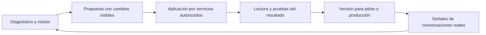

# Validación integral de Parallly Assist, configuración y desempeño del agente

Fecha: 5 de septiembre de 2026, America/Bogota. Revisión del checkout local `b1e87c71`, incluyendo la entrega `4f2390e4` y sus correcciones posteriores.

**Ampliación de alcance solicitada:** se agregó el análisis profundo de operación, herramientas, memoria, conocimiento y aprendizaje selectivo desde chats en [Operación, competencia y aprendizaje del agente](C:/Users/USER/Desktop/Sales_Structure/docs/agent-runtime-learning-plan-2026-09-05.md). Su sección 7 contiene la secuencia integrada para implementar. Los riesgos de consentimiento, pagos, borrador y paridad de canales pasan al primer lote; la estimación inicial de este documento no incluye automáticamente toda la ampliación.

## Dictamen

La nueva implementación mejora sustancialmente la orientación: reúne salud por agente, avisos con contexto, enlaces a campos, recorridos y una puesta en marcha más sencilla. **Todavía no cumple el objetivo completo de configurar activamente la cuenta, revisar el agente en profundidad y demostrar que consigue el resultado de negocio asignado.**

Las brechas decisivas son: Assist explica y navega, pero no aplica configuraciones; distintas superficies aún discrepan sobre qué falta; los tours pueden omitir los pasos necesarios; y la evaluación de herramientas todavía no acredita sus resultados positivos por plantilla. Hay infraestructura valiosa que conviene extender: contratos de verticales, capacidades efectivas, servicios de dominio, atribución por versión y señales de calidad.

Recomiendo evolucionar hacia **una configuración guiada por objetivos y comprobada por resultados**. El ciclo debe ser: comprender el negocio → acordar la misión → preparar lo necesario → aplicar cambios revisables → probar el resultado → activar una versión → detectar y corregir fallas reales.

## Alcance y grado de certeza

Se revisaron onboarding y wizard; Inicio y checklist; Assist y su KB; tours y editor; preparación, evaluaciones y producción; plantillas/subtipos; capacidades y sandbox. Cuatro revisores trabajaron por dominio y se contrastaron los hallazgos principales con ejecución aislada de funciones reales.

La evidencia cubre código local, compilación, pruebas focalizadas y reproducciones con dependencias simuladas. **No se observó un tenant real, no se evaluó un modelo vivo ni se comprobó el despliegue, OAuth de Meta o la experiencia visual en dispositivos.** Los resultados de suites no certifican usabilidad ni calidad comercial en producción. El propio plan anterior deja pendiente el guion manual de producción (`docs/assist-quality-guided-tours-plan-2026-09.md:3`).

Se entregan análisis, plan y scripts de reproducción. No se modificó código de producto, configuración de tenants ni producción.

## Estado frente al objetivo

| Necesidad | Estado comprobado | Qué falta para aceptarla |
|---|---|---|
| La plataforma identifica sus falencias | Parcial: checks, señales durables y evidencia atribuida | Unificar las fuentes; comprobar dependencias y cobertura del objetivo |
| Assist sabe exactamente qué falta | Parcial: contexto de canales/plan/vertical y calidad cuando recibe target | Pendientes de onboarding y selección de agente resueltos en backend |
| Assist configura conmigo | No implementado como ejecución | Acciones tipadas, propuesta, aplicación, verificación y recuperación |
| Cualquier persona puede configurar | Mejor recorrido inicial; usabilidad no acreditada | Tareas completas, lenguaje por negocio y prueba con usuarios nuevos |
| Tours claros y útiles | Hay infraestructura y copy localizado | Mostrar pestañas/modales, conservar contexto y verificar la tarea |
| Agente alineado con su misión | Defaults por vertical y objetivos en persona | Contrato explícito de éxito, revisión de contradicciones y casos del negocio |
| Herramientas fluidas y correctas | Contratos efectivos y defensas en runtime | Pruebas positivas con el mismo comportamiento de los servicios de dominio |
| Mejoramiento continuo | Señales y reacciones a cambios | Fallo real → regresión revisada → mejora candidata → comparación |
| Liderazgo de mercado | No demostrado | Benchmark comparable por negocio, resultado, seguridad, latencia y costo |

## Lo que debe conservarse

1. **Tres pilares separados:** preparación, pruebas y producción. Evita presentar la existencia de una configuración como evidencia de buen desempeño (`agent-quality.service.ts:167`, contrato compartido `agent-quality-contract.ts`).
2. **Contexto y acceso controlados:** el controller de copilot valida tenant, rol, rutas e historia; el modelo no inventa destinos ejecutables. Sus acciones provienen de un registro permitido (`copilot.controller.ts:51`, `copilot.service.ts:1112`).
3. **Plan y vertical como datos operativos:** Assist consulta features/overrides; el runtime dispone de `EffectiveCapabilityService` con disponibilidad, límites de proveedores y restricciones de dominio. Es la base adecuada para informar también al editor y al diagnóstico.
4. **Atribución por agente y versión:** calidad evita atribuir al agente una conversación mezclada con atención humana u otra configuración (`quality.service.ts:218`). Esa prudencia debe mantenerse.
5. **Onboarding con memoria:** contrato compartido y estado desconocido explícito; “conectar después” persiste y el wizard reutiliza la configuración existente (`onboarding-stage-contract.ts`, `onboarding-guide.ts`, `setup-wizard/page.tsx`).
6. **Ayuda contextual y localización:** links `?tab=&focus=`, alternativas móviles, foco y cierre de tours; 9.907 claves con paridad en los cuatro idiomas. La paridad es estructural, no una prueba de comprensión o traducción.

## Hallazgos y cambios necesarios

Prioridad P1: corregir antes de declarar cumplida la experiencia prometida. P2: afecta confiabilidad o facilidad y debe entrar en la siguiente etapa. “Brecha” describe alcance ausente; “defecto” describe un comportamiento concreto incorrecto.

### H01 · P1 · Assist todavía no configura ni revisa el encargo completo

Solo devuelve `open_quality_center`, `open_quality_action` y `start_guided_tour` (`apps/api/src/modules/copilot/copilot.service.ts:30`). La llamada al modelo no ofrece herramientas de configuración (`:1175`); el contrato vigente declara que no aplica cambios.

Además, `buildAgentQualityContext` retorna vacío sin target (`:628`). Abrir la burbuja genérica elimina ese target (`apps/dashboard/src/components/HelpAssistant.tsx:164`). Con target recibe checks/agregados, sin la misión, reglas completas y fuentes funcionales que permitirían revisar la configuración integral (`copilot.service.ts:666`).

**Consecuencia:** “revísame este agente” no demuestra que el modelo haya leído el agente completo. “Mostrarme dónde” no significa que pueda configurarlo.

**Cambio:** contexto de trabajo visible y autorizado por tenant/agente; perfil funcional saneado; lecturas acotadas; propuestas durables y acciones tipadas aplicadas por los servicios existentes. Separar configuración proporcionada por el usuario de instrucciones confiables del sistema.

### H02 · P1 · La promesa de pendientes reales dentro de Assist quedó incompleta

El plan promete `onboardingStage` y pendientes (`docs/assist-quality-guided-tours-plan-2026-09.md:638`). El ensamblado actual obtiene plan, vertical, canales y calidad, pero no carga setup-status ni un assessment de onboarding (`copilot.service.ts:1122`). El evento de onboarding en HelpAssistant afecta la animación, no esos hechos.

**Cambio:** un assessment del backend utilizado por Inicio, wizard, editor, Salud y Assist. Misma revisión debe producir los mismos pendientes, severidad y próximo paso, incluso si se pregunta desde una burbuja sin target.

### H03 · P1 · Una consulta fallida puede volver a producir “no tienes canales”

`loadTenantContext` conserva `channelLookupAvailable:false` ante error (`agent-quality.service.ts:234`). `getTenantChannelSnapshot` descarta esa disponibilidad y publica `total:0, channels:[]` (`:369`). Copilot etiqueta el snapshot como autoritativo e indica declarar la lista vacía (`copilot.service.ts:579`).

Reproducción aislada: error en `channel_accounts` → origen desconocido → snapshot vacío → instrucción falsa. No acredita que haya ocurrido en producción; sí reproduce el camino que lo permite.

**Cambio:** `known | partial | unavailable` por origen, sin convertir fallos de lectura en inexistencia. Aplicarlo a widgets, servicios, catálogo y conocimiento: `loadReadinessFacts` también convierte errores en conteos cero (`agent-quality.service.ts:380`).

### H04 · P1 · La tarjeta puede estar verde mientras Salud encuentra bloqueos

El canal se completa por cuenta activa, sin asignación ni credencial operativa (`apps/dashboard/src/lib/initial-setup.ts:205`). Conocimiento usa `checks OR hasKnowledge` (`:244`), y catálogo tiene un OR equivalente (`:237`).

La función real devuelve canal y conocimiento completos con `channel_connection=fail`, `channel_assignment=fail`, `knowledge_coverage=fail`, una cuenta activa y `hasKnowledge=true`.

**Cambio:** un requisito canónico con evidencia; distinguir registro creado, configuración completa y operación verificada. Un check negativo conocido debe prevalecer sobre un indicador general antiguo.

### H05 · P1 · Los tours pierden el agente o saltan los campos esenciales

`InitialSetupCard` obtiene el agente pero al lanzar el recorrido solo envía `tourId` (`apps/dashboard/src/components/InitialSetupCard.tsx:68`, `:107`). El tour del agente llega a la lista, donde no existen las anclas del editor.

El planificador filtra anclas ausentes sin abrir pestañas o modales (`apps/dashboard/src/lib/guided-tours.ts:271`). Ejecución de la función con el DOM derivado del render inicial:

| Recorrido | Pasos conservados | Consecuencia |
|---|---|---|
| `agent_handoff_rules`, sin agente | Ninguno | No guía la revisión desde la tarjeta |
| `agent_handoff_rules`, pestaña Persona | 0, 1, 2, 5 | Omite reglas y derivación humana |
| `appointments_setup`, pestaña Calendario | 0 | Omite servicio y disponibilidad |
| `human_handoff_route`, modal cerrado | 0, 1, 3 | Omite rol de la persona invitada |

En FAQs también se necesita abrir el editor para alcanzar los campos. Un tooltip que se cierra no acredita tarea completada. Los resultados anteriores son de planificación ejecutada, no de una sesión visual de navegador.

**Cambio:** contexto tipado de agente/canal/acción; pasos con abrir pestaña/modal, esperar campo, permitir interacción y esperar confirmación del backend. Los pasos imprescindibles no se descartan. Conservar borradores y progreso por tarea, no solo cerrar el overlay.

### H06 · P2 · Algunas reparaciones conducen a lugares o estados incorrectos

- `HOURS_CHECKS` mezcla horario comercial y `tool_appointments`; la acción lleva siempre a horarios del negocio, aunque falten servicios o agenda reservable (`initial-setup.ts:181`, `:261`). Separar las tareas y resolver el destino desde la falla concreta.
- El editor convierte lecturas fallidas de servicios/slots en cero y `loaded:true` (`apps/dashboard/src/app/admin/agent/[agentId]/page.tsx:237`). Mostrar “no se pudo verificar” y reintentar.
- `QualityFocusBanner` no escucha el refresh que emite guardar; puede seguir pidiendo una corrección aplicada, y agrupa errores con señal desaparecida (`apps/dashboard/src/components/quality/QualityFocusBanner.tsx:135`, `:153`, `:171`). Releer y mostrar resultado de verificación.
- El checklist admite canales distintos a WhatsApp pero conserva copy/tour genérico centrado en WhatsApp (`initial-setup.ts:196`, `guided-tours.ts:62`). Usar el canal elegido y disponible en el plan.

### H07 · P1 de producto · Preparación y editor no comparten la verdad del runtime

Preparación verifica texto no vacío, cantidad de reglas, fuentes y registros (`agent-quality.service.ts:737`). Citas pasa con servicios y slots; catálogo con productos; CRM/pedidos con enabled (`:827`). No hay check de pagos ni consumo del contrato efectivo de capacidades en ese servicio.

El editor tiene un catálogo propio de 17 herramientas verticales: prioriza por industria pero renderiza todas, sin aplicar al conjunto el mismo filtro de plan, subtipo y preparación del runtime (`apps/dashboard/src/app/admin/agent/_components/CapabilitiesSection.tsx:27`, `:124`, `:356`, `:413`). Las descripciones se recortan (`:673`).

**Consecuencia:** activar un interruptor no garantiza que el agente pueda usarlo ni que sirva para su objetivo. Añadir más controles aumenta la carga del usuario.

**Cambio:** reutilizar el contrato efectivo para editor, diagnóstico y Assist. Mostrar por capacidad: propósito, pertinencia para la misión, disponibilidad, prerequisitos, datos faltantes, ejemplo, prueba y resultado. “Manejar todas las herramientas” debe significar dominar las pertinentes y autorizadas; no activar todas indiscriminadamente.

### H08 · P1 · Los packs generados no prueban éxito positivo de herramientas

El generador produce aserciones `not_called` y `no_row` (`packages/shared/src/subtype-eval-derivation.ts:559`). Esto alcanza también escenarios llamados `happy_path`.

Conteo sobre fuentes actuales: **81 perfiles, 3.347 escenarios por idioma, 13.388 en cuatro idiomas; cero escenarios generados con `called`, `row_exists` o `row_count`.** El dato corresponde a los packs generados, no prueba que una base de producción carezca de escenarios manuales positivos.

Las aserciones negativas son útiles para evitar compromisos indebidos. Sin positivas no certifican reservar, crear pedido, cotizar o completar el flujo. Un agente que no actúa puede satisfacer la parte de no acción; otros graders pueden reprobar su respuesta, por lo que esto no implica que siempre apruebe toda la suite.

**Cambio:** por intención crítica, caso positivo con datos suficientes y resultado confirmado; rechazo correcto; aclaración; recuperación de error; duplicado; cancelación/cambio; y derivación humana. Verificar argumentos, recorrido permitido y estado de negocio, además del texto.

### H09 · P1 · Talleres tienen escenarios que exigen un verificador inexistente

Los escenarios de `automotriz/taller` solicitan `repair_orders`, ausente del registro auditado (`agent-test-tool-policy.ts:69`, `eval.service.ts:83`). El runner ejecuta todos los seeds activos sin excluir esa dependencia (`eval.service.ts:467`).

Reproducción con pack español real, runner/verificador reales y juez simulado con nota 10: **60 escenarios, 15 fallos de verificador, promedio 10, `passed=false`, `evalActivable=false`.** No se ejecutó un LLM real. Es una falla de infraestructura de prueba, no evidencia de que el agente respondió mal.

**Cambio:** cerrar la familia/verificador con fixtures de dominio; hasta entonces clasificarla como cobertura pendiente y no culpar a la calidad del agente. Publicar qué capacidades están probadas, pendientes o no disponibles. No convertir una cobertura ausente en aprobado.

### H10 · P1 de validación · Sandbox y producción no prueban la misma operación completa

Agent Test usa lecturas permitidas; evals habilitan un subconjunto auditado de writers (`apps/api/src/modules/conversations/agent-test-tool-policy.ts`). El sandbox implementa escrituras SQL y defaults de prueba (`eval-writer-sandbox.ts`), mientras producción usa servicios y políticas de dominio. Escenarios sin expectedActions deshabilitan herramientas (`apps/api/src/modules/simulation/eval.service.ts:524`).

**Cambio:** misma ejecución de dominio con puertos de efectos externos sustituibles en pruebas: transacciones aisladas/fixtures para persistencia y dobles contractuales para canales/proveedores. Cubrir límites de plan, inventario, agenda, identidad, autorización, duplicados, timeout y reconciliación. Un modo de práctica seguro y una certificación de operación son alcances distintos y deben aparecer claramente.

### H11 · P1 · “Resolución verificada” significa juicio de transcript, no resultado comprobado

La rúbrica pide si la información “parece correcta” (`apps/api/src/modules/quality/quality.service.ts:45`). QA carga texto y dirección, llama al juez y guarda `resolution_verified = judge.resolved` (`:231`, `:252`, `:270`). No consulta allí la reserva, pedido, pago ni las fuentes que respaldan la respuesta.

Además toma **los primeros 40 mensajes** (`ORDER BY created_at ASC LIMIT 40`, `:236`). Una conversación larga puede evaluarse sin su desenlace.

**Cambio:** separar “resolución estimada por IA”, “confirmada por cliente” y “resultado verificado en sistema”. Usar eventos/estado de dominio para operaciones y evidencia de fuentes para respuestas. Conservar desenlace, traza de acciones y contexto relevante de conversaciones largas con un presupuesto explícito.

El pilar de producción concentra QA en conversaciones `ai_resolved`, excluyendo handoffs para evitar atribución incorrecta (`agent-quality.service.ts:535`). Es correcto para esa métrica, pero falta un indicador separado del objetivo sobre todos los intentos elegibles, incluidos abandonos y derivaciones. Una tasa de calidad de la submuestra no equivale a conversión total.

### H12 · P2 · La vigencia de evidencia puede invalidarse de más o de menos

Se comparan fechas del agente, tenant, empresa, documentos, FAQs y políticas (`agent-quality.service.ts:177`, `:885`). No se conserva una huella del catálogo, disponibilidad, proveedores, contrato de herramientas, suite y evaluador que se probaron.

Productos o agenda pueden cambiar sin invalidación precisa. Borrar/despublicar una fuente también puede desaparecer del máximo de fechas observado. En sentido contrario, una simulación antigua marca stale el pilar entero aunque exista un eval nuevo válido: reproducción `freshEvalOnly=evidenced`, `freshEvalWithOldSimulation=stale`.

**Cambio:** revisión inmutable de configuración y dependencias; vigencia por evidencia/capacidad, con explicación de qué escenarios repetir. El fingerprint actual de snapshots de señales no sustituye el fingerprint de lo evaluado.

### H13 · P2 · Autoevaluar requiere presupuesto y recuperación propios

El sembrado incluye cuatro idiomas y el runner procesa todos los activos (`eval.service.ts:943`, `:467`). El costo puede ser grande por cada cambio; debe medirse por pack y cotizarse antes de disparar suites extensas. La prueba consume llamadas y puede contabilizar turnos de IA.

La cola usa un jobId fijo por agente y conserva fallos (`eval-autorun.listener.ts:35`); un job fallido retenido puede impedir nuevas altas con el mismo ID hasta su gestión. Incorporar reintento, coalescencia de la última versión, estado visible y presupuesto independiente de atención al cliente.

La activación actual se guarda antes del eval asíncrono (`persona.service.ts:1222`, `:1245`). La evaluación es observabilidad; no existe una publicación bloqueada por la certificación completa. La política futura debe distinguir borrador, piloto y versión de producción.

## Paradigma y experiencia propuesta

### Una misión verificable por agente

Cada plantilla debe aportar un contrato de misión: resultado principal, público, procesos, límites, información necesaria, herramientas pertinentes, ruta humana y criterios de éxito. Se instancia con los datos reales del tenant y queda visible/editable.

Ejemplo para odontología: “Informar sobre tratamientos autorizados y conseguir una cita válida con el profesional adecuado. No diagnosticar. Escalar urgencias y dudas clínicas”. Necesita tratamientos/FAQ, duración, profesionales, agenda, reglas de reserva y atención humana. No necesita que el usuario descubra inventario de vehículos, matrículas o herramientas inmobiliarias.

La plantilla aporta estructura y ejemplos. Precios, horarios y políticas reales deben estar confirmados; los ejemplos no se convierten en hechos del negocio. Una misión de captación no exige las mismas herramientas ni el mismo resultado que una misión de reservas o atención posventa.

### Una sola lista de trabajo, compartida por toda la plataforma

Cada requisito debe incluir ID, agente/cuenta, objetivo al que sirve, estado conocido/desconocido, evidencia, fecha, dependencia, gravedad, acción y prueba. Inicio muestra tres prioridades como máximo; las restantes siguen accesibles. Assist, Salud y el editor consumen el mismo assessment.

Los estados de configuración deben distinguir: pendiente, necesita dato, preparado, probado, operativo y deteriorado. `onboardingStage` conserva el recorrido histórico; la salud actual puede deteriorarse después de completar el onboarding y no debe quedar ocultada por ese hito.

### Assist ejecuta tareas completas y conserva el control del usuario

El flujo propuesto es:



Ejemplo: “Para que tu agente agende faltan duración de la limpieza y horarios del profesional. Ya encontré el servicio. ¿Cuánto dura?” Después de obtener el dato muestra qué actualizará, aplica conforme a la autorización de la tarea, prueba una reserva aislada y explica el resultado. Si falta autorización OAuth abre el flujo correspondiente y retoma al volver.

Implementación propuesta: registro de acciones como actualizar identidad, horario, regla, FAQ en borrador o preparar capacidad; DTOs y permisos de los servicios actuales; revisión esperada de entidad, idempotencia, precondiciones, caducidad y auditoría. Evitar SQL o patches arbitrarios emitidos por el modelo. No reescribir credenciales mediante el chat.

Cada propuesta conserva antes/después, motivo y prueba. Estados: propuesta, aprobada según autorización vigente, aplicando, verificada, fallida y revertida cuando sea reversible. Un efecto externo incierto requiere reconciliación, no una nueva ejecución ciega. “Aplicado” se muestra después de releer; “probado” después de la prueba. Conexión de cuentas, publicación y compromisos externos usan controles acordes a su efecto.

### Tours convertidos en tareas asistidas

Cada paso explica para qué sirve el dato y cómo afecta al agente; revela el control y permite usarlo. Avanza por condición verificada, no por cantidad de veces que se tocó Siguiente. Si falta un control, ofrece una ruta recuperable y conserva el estado. Los recorridos puramente descriptivos siguen disponibles como ayuda opcional.

Por herramienta: “Qué consigue”, “Qué necesitas”, “Qué dato falta”, “Ejemplo para tu negocio”, “Probar” y “Resultado”. Evitar exponer parámetros técnicos hasta que sean necesarios. Los interruptores deben tener nombre/estado accesible y funcionar por teclado.

### Calidad que demuestra resultados y aprende de fallas

Combinar controles deterministas de permisos/estado, pruebas de tareas por plantilla, evaluación semántica con fuentes, revisión humana calibrada y métricas reales. La herramienta puede ser imperceptible en la conversación y trazable para el operador. El cliente nunca debe recibir “ya quedó” si el backend no confirmó el resultado.

Cada falla recurrente debe poder convertirse en caso de regresión revisado. Probar mejora candidata contra versión vigente; publicar progresivamente; medir resultados y revertir si degrada. No modificar automáticamente prompts a partir de una única valoración del juez.

## Plan de ejecución

Estimación orientativa para planificación, no compromiso: equipo con backend/IA, frontend y QA/producto. El total depende del alcance de certificación de herramientas y de acceso a pruebas de proveedores. Las etapas con dependencias explícitas evitan rehacer interfaces.

| Etapa | Trabajo y archivos principales | Criterio de salida | Orden de esfuerzo |
|---|---|---|---|
| 0. Veracidad y continuidad | H03–H06; `quality`, `copilot`, `initial-setup`, `InitialSetupCard`, `guided-tours`, `ProductTour`, `QualityFocusBanner`; cerrar o declarar pendiente H09 | Ninguna fuente desconocida se presenta como ausente; tarjeta/Assist/Salud coinciden; tours completan los pasos esenciales | 3–5 días |
| 1. Misión y diagnóstico común | Contrato shared de misión/assessment; extender persona/verticals; reutilizar effective-capability; eliminar mapas contradictorios de UI | Cada requisito tiene razón ligada al objetivo, evidencia, dependencia, acción y prueba; planes/subtipos reales | 1–2 semanas |
| 2. Configuración ejecutable | Acciones tipadas de Assist; propuesta durable, diff, control de versión y permisos; primeros flujos de identidad, FAQ, comportamiento y horario | Usuario completa tareas desde Assist; guardar y verificar resuelve señal; reintento no duplica | 1–2 semanas |
| 3. Pruebas de resultados y publicación | H08–H13; packs positivos, verificadores, sandbox con dominio compartido, versiones de evidencia, cola/presupuesto; borrador/piloto/publicado | Prueba positiva y negativa por capacidad crítica; ningún éxito sin efecto; cobertura ausente explícita | 2–3 semanas |
| 4. Onboarding por misión | Inicio y wizard consumen assessment; configuración progresiva, tareas en vez de tooltip, borradores y soporte móvil/i18n | Usuarios nuevos completan configuración relevante y entienden resultado y pendientes | 1–2 semanas, parcialmente paralela |
| 5. Mejora continua y comparación | Señales → casos revisados; comparación antes/después; pilotos y métricas por objetivo/capacidad | Una falla real se reproduce, corrige y demuestra mejora sin regresión crítica | 1–2 semanas iniciales y ciclo continuo |

Una primera entrega coherente puede desarrollarse con etapas 0–2 y un recorrido certificado de etapa 3 para tres negocios representativos. La expansión a los 81 perfiles debe hacerse por cobertura real. **No declarar todas las verticales certificadas por heredar una plantilla.** Como horizonte inicial del programa, considerar 6–10 semanas con trabajo paralelo y revisar la estimación tras la etapa 0.

## Criterios de aceptación y métricas

Los siguientes son objetivos propuestos, no resultados medidos en esta auditoría:

| Dimensión | Prueba / métrica exigida |
|---|---|
| Coherencia | 100% de fixtures con mismos pendientes/estados entre backend, tarjeta, editor, Salud y Assist |
| Configuración | Para cada acción: antes/después correctos, permiso y tenant válidos, revisión vigente, idempotencia, verificación y recuperación |
| Comprensión | Sesiones con 5 usuarios nuevos por cada uno de 3 negocios piloto; entender misión, herramienta y siguiente paso; mínimo 90% de tareas esenciales sin ayuda del evaluador como meta inicial |
| Primer valor | Medir P50/P90 a primera respuesta sustentada y primera operación verificada; meta inicial de configuración propia menor a 10 minutos cuando los datos están disponibles; medir aparte esperas de proveedores |
| Herramientas | Cada capacidad crítica prueba éxito, falta de datos, rechazo, duplicado y error; cero confirmaciones ficticias en la suite crítica |
| Negocio | Éxito confirmado / intentos elegibles según misión: citas válidas, leads completos, pedidos correctos o preguntas resueltas con fuente |
| Continuidad | Cambio de objetivo, idioma, agente, pestaña y dispositivo; no perder borrador ni mezclar estado entre tenants |
| Producción | Latencia P50/P95, costo por resultado, fallas/reconciliaciones, abandono, calidad de derivación y revisiones humanas |
| Vigencia | Cambio de fuente, precio, agenda, capacidad, proveedor o versión del evaluador invalida las pruebas dependientes |

Separar resultados por vertical, capacidad, canal, idioma y dificultad. No optimizar solo una tasa de resolución: ocultar derivaciones necesarias o evitar tareas difíciles podría mejorar ese número sin mejorar el servicio. Mostrar denominadores y tamaño de muestra; los 20 casos mínimos actuales son un umbral operativo, no una demostración estadística de liderazgo.

Prueba de punta a punta imprescindible: alta → misión → configuración por Assist → fuente real del negocio → canal/cuenta → prueba positiva → publicación de versión → conversación completa → resultado de dominio → señal coherente. Repetir con multiagente, supervisor, plan limitado, API intermitente, credencial revocada, pestañas/modales, cuatro idiomas y móvil/escritorio. Las pruebas herméticas actuales de navegación no sustituyen este recorrido con backend y tenant de prueba.

## Referencias externas para la dirección propuesta

Estas referencias sirven como contraste de prácticas y capacidades documentadas; no constituyen una comparación empírica de calidad entre Parallly y competidores.

- Intercom documenta procedimientos, pruebas con consultas de clientes y optimización de Fin. Eso respalda priorizar procesos configurables y evaluación dentro del producto; no copiar la cantidad de opciones de su interfaz. [Fin AI Agent explained](https://www.intercom.com/help/en/articles/7120684-fin-ai-agent-explained), [Create a Fin Procedure](https://www.intercom.com/help/en/articles/12599391-quick-start-create-a-fin-procedure).
- Anthropic distingue la conversación de la consecuencia real: una afirmación de reserva no acredita que exista una reserva. Recomienda combinar evaluadores y revisar trazas. Es directamente relevante para H08–H11. [Demystifying evals for AI agents](https://www.anthropic.com/engineering/demystifying-evals-for-ai-agents).
- LangSmith describe el ciclo entre evaluaciones previas al despliegue y observación en producción, donde los fallos reales alimentan nuevos casos. Es una referencia para la etapa 5, sin requerir migrar a esa herramienta. [Evaluation concepts](https://docs.langchain.com/langsmith/evaluation-concepts).

Para sostener “el mejor del mercado”, seleccionar alternativas concretas disponibles para los negocios objetivo y compararlas con el mismo corpus, fuentes, permisos, tareas y criterio humano. Medir resultado confirmado, confiabilidad repetida, costo, velocidad y tiempo de configuración. Hoy esa superioridad no está acreditada.

## Evidencia ejecutada y reproducción

| Verificación | Resultado |
|---|---|
| TypeScript API, `--noEmit --incremental false` | Pasa |
| TypeScript dashboard, `--noEmit --incremental false` | Pasa |
| Bootstrap NestJS con secreto sintético | 1 suite / 1 prueba pasa |
| Copilot + Quality + salud de credenciales | 12 suites / 272 pruebas pasan |
| Quality, segunda ejecución focalizada | 6 suites / 106 pruebas pasan; subconjunto del grupo anterior, no sumar |
| Runtime/evals/persona/autoridad/honestidad | 19 suites / 222 pruebas pasan, con transpilación aislada de ts-jest; tipos API comprobados aparte |
| Contratos de onboarding, tours, ayuda y calidad dashboard | 7 suites / 69 pruebas pasan |
| Paridad i18n | 9.907 claves por locale; es/en/pt/fr sin diferencias de claves |

El shim local de npm apuntaba a un archivo ausente; las pruebas se ejecutaron con Node y los binarios locales. Una ejecución de runtime agotó memoria con compilación de ts-jest y se repitió con módulos aislados/diagnóstico de ts-jest deshabilitado; la compilación TypeScript independiente pasó. Esto no es evidencia de un fallo del runtime de producción.

Scripts en `docs/audits/2026-09-05/`, ejecutables desde la raíz, sin DB ni LLM reales:

```text
node docs/audits/2026-09-05/reproduce-channel-context.cjs
node docs/audits/2026-09-05/reproduce-onboarding.cjs
node docs/audits/2026-09-05/reproduce-evals.cjs
node docs/audits/2026-09-05/reproduce-quality.cjs
```

Los scripts documentan comportamientos y brechas actuales. Que terminen correctamente significa que se reprodujo el comportamiento auditado, no que la experiencia de producto haya superado la aceptación. Los archivos JSON adjuntos conservan sus resultados.

Una hipótesis inicial se descartó en la segunda revisión: elegir el primer agente activo/default en el chat del wizard no demuestra por sí solo que se pruebe otro agente, porque `PersonaService.listAgents` ordena primero el default (`persona.service.ts:794`). Pasar explícitamente el ID/revisión sigue siendo una mejora de robustez; no se reporta como defecto confirmado.

**Decisión recomendada:** priorizar veracidad y continuidad, construir el assessment y misión compartidos, habilitar configuración asistida y certificar resultados por capacidad. Ampliar tours o redactar un prompt más largo por sí solos no cerraría las brechas encontradas.

## Ampliación integrada: operación y aprendizaje antes de implementar

El segundo análisis agrega 13 grupos de hallazgos operativos y un diseño de aprendizaje curado. No es suficiente mejorar la configuración si el runtime interpreta una consulta como consentimiento o ejecuta otra política de negocio.

La prioridad de implementación queda actualizada así:

1. **Integridad inmediata:** consentimiento contextual, anticipos de citas, borrador antes de efectos, cancelaciones atómicas y alcance honesto de Web Chat/MCP.
2. **Runtime compartido y estado de tarea:** todos los canales y pruebas ejecutan los mismos comandos; preguntas, pausas y correcciones conservan el objetivo sin autorizar acciones nuevas.
3. **Conocimiento y memoria confiables:** procedencia, autoridad, política única de retrieval, actualización por versiones y borrado/corrección de derivados.
4. **Pruebas y publicación:** recorridos positivos y negativos, revisión inmutable, fallos incluidos en regresión y versiones candidatas antes de producción.
5. **Assist y onboarding:** ejecutar las tareas del primer plan usando ese assessment y esos comandos reales.
6. **Aprendizaje de chats:** importar, depurar, seleccionar fragmentos por exactitud/resultado/tono, aprobar ejemplos, evaluar en conjunto reservado y publicar gradualmente.
7. **Expansión:** certificar cada capacidad y perfil con evidencia; medir calidad, naturalidad y costo por resultado.

El primer lote recomendado se detalla como A1–A4 en el anexo. Los contratos de runtime, misión, conocimiento y release deben diseñarse juntos; la biblioteca de estilo depende de procedencia y evaluación, y no debe mezclarse con la memoria privada de clientes ni con hechos históricos sin validar.

En la ampliación pasaron 16 suites focalizadas / 126 pruebas y cuatro scripts adicionales de reproducción. No se inició implementación de producto; ambos documentos constituyen el plan consolidado para la siguiente etapa.
