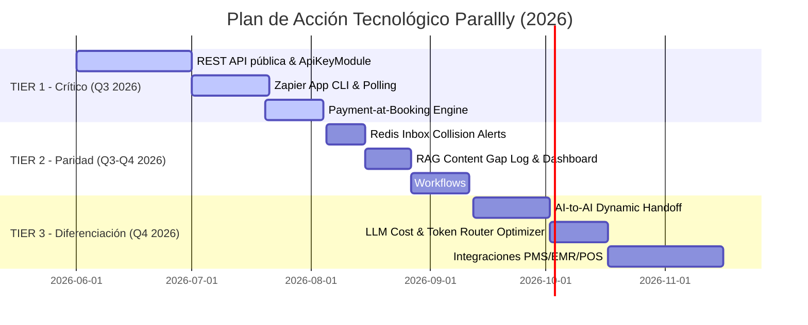

# Parallly — Análisis Competitivo y Arquitectura de Dominio Tecnológico (Mayo 2026)

## Resumen Ejecutivo y Posicionamiento

Este documento amplía el análisis competitivo original cruzando cada una de las **25 dimensiones funcionales** directamente con la **realidad técnica de nuestro monorepo** (NestJS 10, Next.js 16, pgvector, Redis, BullMQ y PgBouncer). 

Parallly no es solo una plataforma horizontal de mensajería (como Manychat o Respond.io) ni un software vertical rígido (como Guesty o Mindbody). Nuestra propuesta de valor única radica en ser la **primera plataforma de automatización de ventas multi-canal y multi-agente con adaptación vertical profunda e inteligente**.

A continuación se detalla, dimensión por dimensión, cómo funciona hoy nuestra plataforma a nivel de código, cómo se compara con los líderes de la industria y el **plano técnico exacto (Blueprint)** para alcanzar y mantener el liderazgo absoluto del mercado.

---

## PARTE 1: SCORECARD TÉCNICO COMPARATIVO

| # | Dimensión Funcional | Score | Módulo en Codebase actual | Competidor de Referencia | Blueprint para Liderar el Top (10/10) |
|---|---|---|---|---|---|
| 1 | **Canales de Messaging** | **7/10** | `src/modules/channels` | Respond.io (12+ canales) | Añadir `EmailModule` (IMAP/SMTP) como canal e integrar Twilio Voice. |
| 2 | **AI Conversacional** | **8/10** | `src/modules/ai`, `conversations` | Intercom Fin | Implementar tracking de *Containment Rate* y fallback automático por latencia. |
| 3 | **AI Knowledge / RAG** | **8/10** | `src/modules/knowledge` | Intercom | Loguear búsquedas fallidas y crear el dashboard de *Content Gaps*. |
| 4 | **Multi-Agente AI** | **9/10** | `src/modules/persona` | GoHighLevel (básico) | **Líder actual**. Implementar *AI-to-AI Dynamic Handoff* (`transfer_to_agent`). |
| 5 | **LLM Router** | **9/10** | `src/modules/ai/router` | Zendesk / Bedrock | **Líder actual**. Implementar *Dynamic Cost/Token Routing* (ahorro del 60%). |
| 6 | **CRM — Contactos** | **7/10** | `src/modules/crm` | HubSpot | Introducir entidad `Organizations` para mapeo B2B estructurado. |
| 7 | **CRM — Pipeline/Deals** | **6/10** | `src/modules/pipeline` | HubSpot | Soportar múltiples pipelines por tenant (`crm_pipelines` table). |
| 8 | **CRM — Lead Scoring** | **6/10** | `src/modules/crm/services` | HubSpot (predictivo) | Scoring dinámico basado en eventos conversacionales e interacciones. |
| 9 | **CRM — Segmentación** | **6/10** | `src/modules/crm/services` | Respond.io | Conectar segmentos dinámicos directamente al motor de campañas BullMQ. |
| 10 | **Automatización** | **6/10** | `src/modules/automation` | Respond.io / Make | Crear nodo de acción `http_request` asíncrono con reintentos exponenciales. |
| 11 | **Inbox / Consola Agente**| **7/10** | `src/modules/agent-console`| Intercom | Implementar *Collision Detection* en tiempo real con Redis y WebSockets. |
| 12 | **Broadcasting** | **6/10** | `src/modules/broadcast` | Manychat | Incorporar A/B Split testing nativo en colas BullMQ de envíos masivos. |
| 13 | **Analytics / Reportes** | **7/10** | `src/modules/analytics` | Zendesk Explore | Automatizar CSAT en cierre de chats e incorporar métricas de costos AI. |
| 14 | **Booking / Citas** | **8/10** | `src/modules/appointments` | Calendly | **Cobro en agendamiento** (*Payment-at-Booking*) con Stripe/MercadoPago. |
| 15 | **Knowledge Base Pública**| **7/10** | `src/modules/knowledge` | Zendesk Guide | Soporte para dominios personalizados de tenants (`kb.brand.com`) vía Redis. |
| 16 | **Billing / Pagos** | **7/10** | `src/modules/billing` | HubSpot Payments | Upgrade/Downgrade self-service con prorrateo automático de cuotas. |
| 17 | **Compliance/Seguridad** | **7/10** | `src/modules/compliance` | Intercom / Zendesk | Restricción estricta por rangos IP (*IP Allowlist*) para tenants Enterprise. |
| 18 | **API / Integraciones** | **3/10** | `src/modules/webhooks` | Zendesk (1,800+ apps) | Crear `ApiKeyModule` con `XApiKeyGuard` y lanzar app pública de Zapier. |
| 19 | **Mobile Experience** | **4/10** | `apps/dashboard` (PWA) | Respond.io (nativa) | Optimizar Service Worker de la PWA para notificaciones push push duraderas. |
| 20 | **UX / Diseño** | **7/10** | `apps/dashboard/src` | Intercom | Lanzar el menú global de comandos rápidos (shortcuts) con `CMD+K`. |
| 21 | **Web Chat Widget** | **6/10** | `src/modules/widget` | Tidio | Triggers proactivos basados en comportamiento web (Exit Intent / Time-on-page). |
| 22 | **White Label** | **7/10** | `src/modules/white-label` | GoHighLevel | Añadir *Sub-account Billing Markup* (rebilling de consumo de tokens de IA). |
| 23 | **E-commerce** | **5/10** | `src/modules/ecommerce` | Tidio / Shopify | Recuperación de carritos abandonados automatizada vía plantillas WhatsApp. |
| 24 | **Adaptación Vertical** | **9/10** | `src/modules/verticals` | Ninguno comparable | **Líder actual**. Integraciones nativas bidireccionales con PMS/EMR/POS. |
| 25 | **Onboarding** | **7/10** | `apps/dashboard/src/app` | Intercom | Checklist interactiva de activación con disparador del primer mensaje de prueba. |

---

## PARTE 2: ANÁLISIS DETALLADO Y BLUEPRINTS POR DIMENSIÓN

---

### 1. CANALES DE MESSAGING
* **Estado Actual en Código**: Implementado bajo `src/modules/channels` y `src/modules/whatsapp`. Contamos con el patrón adaptador `IChannelAdapter` y validación robusta de webhooks con idempotencia en Redis (`idem:{channel}:{id}`).
* **Comparación Gold Standard (Respond.io - 9/10)**: Soporta más de 12 canales nativos incluyendo Email, VoIP y canales customizados.
* **Blueprint para Liderar (10/10)**:
  1. **Crear `EmailModule` como Canal**:
     - Crear un servicio IMAP (`src/modules/channels/email/imap.service.ts`) para escuchar correos entrantes de los clientes de forma asíncrona.
     - Mapear correos a nuestro tipo común `NormalizedMessage` y persistirlos en `conversations`.
     - Implementar envío saliente vía SMTP (`src/modules/email/email.service.ts`).
  2. **Integrar Twilio Voice**:
     - Añadir soporte para llamadas VoIP dentro del inbox utilizando Twilio Voice SDK para recibir y emitir llamadas directamente desde el dashboard.

---

### 2. AI CONVERSACIONAL
* **Estado Actual en Código**: Estructura única con Prompt Assembler de 3 capas (`src/modules/conversations/prompt-assembler.service.ts`): Layer 1 (Contrato e instructivo global), Layer 2 (Persona configurada por el tenant en `src/modules/persona`), Layer 3 (Contexto dinámico de turno). Detección de idioma automática (`LanguageDetectorService`) y motor de citas determinístico.
* **Comparación Gold Standard (Intercom Fin - 9/10)**: Excelente tasa de contención y cobro por resolución.
* **Blueprint para Liderar (10/10)**:
  1. **Seguimiento de Containment Rate**:
     - Agregar `resolved_by_ai: boolean` (default `true`) a `conversations`.
     - Si la conversación dispara el evento `handoff.escalated` en `HandoffService`, cambiar a `false`.
     - Mostrar la tasa en el Dashboard de Analytics:
       $$\text{Contención AI} = \left( \frac{\text{Convos sin Handoff}}{\text{Total de Convos}} \right) \times 100$$

---

### 3. AI KNOWLEDGE / RAG
* **Estado Actual en Código**: Búsqueda híbrida con `pgvector` en `src/modules/knowledge/knowledge.service.ts` cruzando embeddings vectoriales y concordancia de palabras clave con ILIKE. Estructura jerárquica de 5 niveles de conocimiento.
* **Comparación Gold Standard (Intercom - 9/10)**: Analiza brechas de búsqueda de los usuarios que no han tenido coincidencia (Failed searches).
* **Blueprint para Liderar (10/10)**:
  1. **Implementar Failed Search Logs**:
     - Si la consulta en `knowledge.service.ts` devuelve similitudes inferiores al umbral configurado (por ejemplo, `similarityThreshold < 0.75`), registrarla en una nueva tabla `failed_rag_queries`:
       ```sql
       CREATE TABLE failed_rag_queries (
         id UUID PRIMARY KEY DEFAULT gen_random_uuid(),
         tenant_id UUID NOT NULL,
         query_text TEXT NOT NULL,
         max_similarity FLOAT NOT NULL,
         created_at TIMESTAMP DEFAULT NOW()
       );
       ```
  2. **UI de Content Gaps**:
     - Diseñar una pestaña en la sección de Knowledge del dashboard que agrupe las búsquedas fallidas comunes y permita al tenant crear una FAQ directa para subsanar la brecha en un clic.

---

### 4. MULTI-AGENTE AI (DIFERENCIADOR CLAVE)
* **Estado Actual en Código**: Totalmente funcional en `src/modules/persona/persona.service.ts`. Permite configurar múltiples personalidades de IA por canal y asignar turnos específicos, gestionando límites basados en el plan contratado.
* **Comparación Competitiva**: Ni Manychat, ni Respond.io, ni Intercom permiten crear múltiples agentes con prompts y herramientas diferenciadas por canal en un único workspace.
* **Blueprint de Dominio (10/10)**:
  1. **AI-to-AI Dynamic Handoff (Transferencia Inteligente)**:
     - Desarrollar la herramienta del sistema `transfer_to_agent(target_agent_id)`.
     - Si un usuario está interactuando con el "Agente de Soporte" y expresa intenciones de compra, el LLM ejecuta la herramienta `transfer_to_agent`.
     - El backend intercepta la acción, cambia el `assigned_agent_id` en la base de datos y recarga dinámicamente el Layer 2 (Persona) del prompt en el siguiente turno. El cliente experimenta una transferencia fluida y transparente en el mismo chat.

---

### 5. LLM ROUTER MULTI-PROVIDER (DIFERENCIADOR CLAVE)
* **Estado Actual en Código**: Enrutamiento avanzado en `src/modules/ai/router/llm-router.service.ts` con soporte para OpenAI, Anthropic, Gemini, DeepSeek y xAI. Circuit breaker implementado en Redis que congela proveedores caídos por 2 minutos.
* **Comparación Competitiva**: La mayoría de las plataformas dependen de un solo proveedor de IA sin mecanismos de contingencia.
* **Blueprint de Dominio (10/10)**:
  1. **Dynamic Cost/Token Routing (Optimizador Inteligente)**:
     - Antes de invocar al LLM, medir el tamaño del prompt acumulado.
     - Para consultas rutinarias de saludo o flujos cortos (< 1,200 tokens), rutear a modelos ultra-económicos (Tier 3/4 como GPT-4o-Mini o DeepSeek-R1).
     - Para consultas complejas con alta carga de RAG o tool calling, elevar el flujo a Tier 1/2 (Claude 3.5 Sonnet).
     - Esto reduce los costos generales de consumo de tokens hasta en un **60%**, protegiendo nuestros márgenes operativos al ofrecer planes con uso ilimitado de IA.

---

### 6. CRM - CONTACTOS
* **Estado Actual en Código**: Módulo `src/modules/crm` sumamente completo con 55+ endpoints, campos dinámicos y mezcla inteligente de identidades redundantes en `src/modules/identity`.
* **Comparación Gold Standard (HubSpot - 10/10)**: HubSpot asocia contactos a empresas (Organizations) con relaciones robustas de muchos a muchos.
* **Blueprint para Liderar (10/10)**:
  1. **Añadir Entidad de Organizaciones B2B**:
     - Crear la tabla `crm_organizations` y su relación con `crm_contacts`:
       ```sql
       CREATE TABLE crm_organizations (
         id UUID PRIMARY KEY DEFAULT gen_random_uuid(),
         tenant_id UUID NOT NULL,
         name VARCHAR(255) NOT NULL,
         domain VARCHAR(255),
         created_at TIMESTAMP DEFAULT NOW()
       );
       ALTER TABLE crm_contacts ADD COLUMN organization_id UUID REFERENCES crm_organizations(id);
       ```
     - Permitir a los agentes consolidar información de múltiples contactos pertenecientes a la misma organización empresarial.

---

### 7. CRM - PIPELINE / DEALS
* **Estado Actual en Código**: Tablero Kanban visual interactivo en `src/modules/pipeline` y `apps/dashboard/src/app/admin/crm/pipeline`. Cuenta con aprobaciones de ofertas y avance automático de fases impulsado por la IA de la conversación.
* **Comparación Gold Standard (HubSpot - 10/10)**: HubSpot permite gestionar múltiples embudos independientes (por ejemplo, Pipeline de Ventas, Pipeline de Renovaciones).
* **Blueprint para Liderar (10/10)**:
  1. **Soportar Múltiples Pipelines por Tenant**:
     - Crear la tabla `crm_pipelines` para independizar las fases por embudo:
       ```sql
       CREATE TABLE crm_pipelines (
         id UUID PRIMARY KEY DEFAULT gen_random_uuid(),
         tenant_id UUID NOT NULL,
         name VARCHAR(255) NOT NULL,
         is_default BOOLEAN DEFAULT FALSE
       );
       ALTER TABLE crm_pipeline_stages ADD COLUMN pipeline_id UUID REFERENCES crm_pipelines(id);
       ```
     - Modificar el dashboard para poder alternar entre diferentes tableros Kanban de forma rápida.

---

### 8. CRM - LEAD SCORING
* **Estado Actual en Código**: Configuración en `src/modules/crm` de puntuación manual mediante 5 ponderaciones configurables a través de controles deslizantes (sliders).
* **Comparación Gold Standard (HubSpot - 9/10)**: Machine Learning predictivo basado en la tasa de conversión histórica.
* **Blueprint para Liderar (10/10)**:
  1. **Scoring Dinámico Basado en Eventos**:
     - Escuchar eventos conversacionales del monorepo y asignar o restar puntos al lead de forma automática:
       - Agendar cita exitosamente: `+30 puntos`.
       - Mensaje entrante del cliente en WhatsApp: `+2 puntos`.
       - Pago de reservación o factura: `+50 puntos`.
       - Período de inactividad mayor a 5 días: `-10 puntos`.
  2. Implementar un cron nocturno que calcule y actualice el lead score acumulado de todos los contactos del tenant en segundo plano.

---

### 9. CRM - SEGMENTACIÓN
* **Estado Actual en Código**: Estructurado en `src/modules/crm/services/segments/segments.service.ts`. Filtra contactos en base a sus atributos personalizados (custom attributes).
* **Comparación Competitiva**: Integración fluida en tiempo real con motores de envío masivo para campañas segmentadas instantáneas.
* **Blueprint para Liderar (10/10)**:
  1. **Campañas en Base a Segmentos Dinámicos**:
     - Modificar la creación de campañas en `src/modules/broadcast` para que acepten un `segment_id` en lugar de una lista fija de IDs de contacto.
     - El procesador BullMQ evalúa el segmento dinámicamente al momento del envío masivo, asegurando que cualquier contacto añadido al CRM en el último minuto reciba la información si califica en el filtro.

---

### 10. AUTOMATIZACIÓN / WORKFLOWS
* **Estado Actual en Código**: Automatizaciones visuales potentes en `src/modules/automation` procesadas a través de colas de BullMQ con soporte de nodos de retraso (delays).
* **Comparación Gold Standard (Respond.io - 9/10)**: Ofrece un nodo HTTP para integrarse asíncronamente con sistemas externos de terceros sin depender de integraciones nativas.
* **Blueprint para Liderar (10/10)**:
  1. **Crear Nodo de Acción `http_request`**:
     - En `automation/action-executor.service.ts`, añadir el ejecutor para peticiones HTTP:
       ```typescript
       async executeHttpRequestAction(action: any, contact: any) {
         const { url, method, headers, body } = action.payload;
         // Reemplazar variables dinámicas como {{contact.phone}}
         const interpolatedUrl = this.interpolate(url, contact);
         await this.httpService.request({
           url: interpolatedUrl,
           method,
           headers,
           data: body
         }).toPromise();
       }
       ```
     - Correr la acción en BullMQ con 3 reintentos y retroceso exponencial para asegurar tolerancia a fallos.

---

### 11. INBOX / CONSOLA AGENTE
* **Estado Actual en Código**: Inbox unificado en tiempo real operando sobre WebSockets en `src/modules/agent-console/agent-console.gateway.ts`. Posee macros, finalización automática, snooze y un cron de escalabilidad de SLAs que corre cada 2 minutos.
* **Comparación Gold Standard (Intercom - 9/10)**: Sistema antifricción de colisión de agentes (Collision Detection) para evitar respuestas duplicadas.
* **Blueprint para Liderar (10/10)**:
  1. **Detección de Colisiones con Redis y WebSockets**:
     - Registrar las visualizaciones de chats de los agentes activos en Redis: `active_view:{conversationId} -> agentId` con un TTL de 8 segundos.
     - Cuando un agente abre un chat, el dashboard emite el evento WebSocket `join_conversation`.
     - El backend guarda el valor en Redis y emite una señal de difusión a todo el tenant: `conversation.viewing` con el perfil del agente.
     - En la interfaz del Inbox de Next.js, mostrar una alerta discreta: *"Juan Pérez está viendo este chat..."* para prevenir respuestas empalmadas.

---

### 12. BROADCASTING / CAMPAÑAS
* **Estado Actual en Código**: Motor de difusión multi-canal con limitador de velocidad de envío integrado de 80 msg/s en `src/modules/broadcast` utilizando colas prioritarias de BullMQ.
* **Comparación Gold Standard (Manychat - 8/10)**: Pruebas A/B sobre envíos de campañas con rastreo de conversiones y enlaces abiertos.
* **Blueprint para Liderar (10/10)**:
  1. **A/B Split Testing en Broadcasts**:
     - Permitir a los usuarios configurar una campaña con dos variantes de mensaje: Mensaje A y Mensaje B, definiendo un porcentaje de distribución (por ejemplo, 50/50).
     - El despachador BullMQ evalúa el índice del job y asigna la variante correspondiente.
     - Almacenar estadísticas de entregado/leído/respondido de manera independiente para cada variante y renderizar un gráfico comparativo directo en el panel de campañas.

---

### 13. ANALYTICS / REPORTES
* **Estado Actual en Código**: Dashboard analítico de 8 pestañas altamente detallado en `src/modules/analytics`. Generación de reportes semanales/mensuales por correo y alertas con umbrales automatizados.
* **Comparación Gold Standard (Zendesk Explore - 9/10)**: Dashboards en tiempo real sumamente robustos para coordinadores y métricas agregadas de satisfacción.
* **Blueprint para Liderar (10/10)**:
  1. **Automatizar Encuestas CSAT en Cierre**:
     - Al resolverse una conversación (sea por agente o por IA), disparar una plantilla interactiva de WhatsApp/SMS solicitando calificación (1-5 estrellas).
     - Almacenar el CSAT en el contacto y calcular promedios históricos, tiempos de primera respuesta y tasas de resolución de IA en tiempo real, presentándolos en gráficos interactivos en el panel de control del supervisor.

---

### 14. BOOKING / CITAS (DIFERENCIADOR CLAVE)
* **Estado Actual en Código**: Motor de reserva robusto en `src/modules/appointments/booking-engine.service.ts` con sincronización bidireccional de Google y Microsoft Calendar. Resolución de disponibilidad de personal en 3 niveles y recordatorios automáticos de asistencia.
* **Comparación Gold Standard (Calendly - 9/10)**: Cobro previo en pasarelas de pago al momento de reservar para mitigar inasistencias.
* **Blueprint de Dominio (10/10)**:
  1. **Pago en Agendamiento (Payment-at-Booking)**:
     - Agregar columna `requires_payment: boolean` y `price: numeric` a la tabla `services`.
     - Si el servicio requiere pago previo, la máquina de estados del bot retiene el espacio horario de forma provisional en Redis (`booking_pending:{convoId}`) por 15 minutos y genera una orden de pago vía `MercadoPagoAdapter` o `StripeService`.
     - Enviar el enlace dinámicamente en el chat. Al validarse la recepción del webhook de pago exitoso, confirmar la cita en PostgreSQL, liberar los bloqueos y despachar correos e iCal de confirmación automáticos.

---

### 15. KNOWLEDGE BASE PÚBLICA
* **Estado Actual en Código**: Help Center público optimizado para i18n disponible en `/kb/{tenant-slug}` con importación masiva y crawling periódico de URLs externas para alimentación automática de RAG.
* **Comparación Gold Standard (Zendesk Guide - 9/10)**: Permite redireccionar dominios corporativos independientes directamente al Help Center.
* **Blueprint para Liderar (10/10)**:
  1. **Soporte de Dominios Personalizados para KB**:
     - Configurar un middleware de resolución de dominios en nuestra app de Next.js.
     - Al recibir una solicitud, verificar el host contra un catálogo de dominios alternativos guardados en una caché de Redis.
     - Cargar y mostrar de forma transparente los contenidos del Help Center correspondientes al tenant propietario sin redireccionar al usuario a nuestro dominio base (`parallly-chat.cloud`).

---

### 16. BILLING / PAGOS
* **Estado Actual en Código**: Adaptador dual de suscripciones implementado en `src/modules/billing` integrando MercadoPago y Stripe. Control de cuotas basado en plan por suscripción y tablero financiero completo para el Super Administrador.
* **Comparación Gold Standard (HubSpot - 8/10)**: Gestión impecable de upgrades de plan a nivel de autoservicio.
* **Blueprint para Liderar (10/10)**:
  1. **Upgrades / Downgrades Automatizados con Prorrateo**:
     - Implementar lógica en `billing.service.ts` para que al realizar un upgrade de plan a mitad del período de facturación, se compute la diferencia prorrateada y se cargue como crédito al tenant en la pasarela de pago seleccionada.
     - Aumentar inmediatamente los límites en la base de datos sin requerir intervención manual por parte de soporte técnico.

---

### 17. COMPLIANCE / SEGURIDAD
* **Estado Actual en Código**: Aislamiento real de datos mediante esquemas independientes por tenant (`apps/api/prisma/tenant-schema.sql`). 2FA configurado y borrado selectivo de 11 tablas para cumplimiento estricto de borrado de datos (GDPR).
* **Comparación Gold Standard (Zendesk - 9/10)**: Restricción y auditoría estricta de accesos mediante listas de IPs permitidas.
* **Blueprint para Liderar (10/10)**:
  1. **Implementar IP Allowlist por Tenant**:
     - Agregar columna `allowed_ips: text[]` a la tabla global de `tenants`.
     - Diseñar un interceptor de NestJS `IpAllowlistGuard` que verifique que las solicitudes al panel de administración del tenant provengan exclusivamente de los segmentos de red autorizados por el administrador, denegando accesos no registrados en planes Enterprise.

---

### 18. API / INTEGRACIONES (BRECHA CRÍTICA)
* **Estado Actual en Código**: Webhooks de salida funcionales ante disparadores conversacionales y API de BI analítica provista con autenticación simple por cabecera de API key.
* **Comparación Gold Standard (Zendesk - 10/10)**: Extensa API REST documentada y mercado masivo de aplicaciones conectadas.
* **Blueprint para Liderar (10/10)**:
  1. **Implementar `ApiKeyModule` Global**:
     - Crear la tabla `api_keys` asociada al tenant global, almacenando hashes seguros de las llaves y alcances definidos (scopes).
     - Diseñar el guard de NestJS `XApiKeyGuard` para autenticar peticiones de manera uniforme en toda la API pública.
  2. **Zapier App CLI**:
     - Crear una aplicación oficial utilizando el CLI de Zapier.
     - Exponer endpoints de polling en la API pública de Parallly como `/api/v1/public/zapier/new-lead` y acciones directas para creación de contactos y envíos de chats instantáneos.

---

### 19. MOBILE EXPERIENCE (BRECHA CRÍTICA)
* **Estado Actual en Código**: PWA responsive básica estructurada con manifiesto y service workers.
* **Comparación Gold Standard (Respond.io - 8/10)**: App nativa de alto desempeño en iOS y Android con persistencia offline de datos.
* **Blueprint para Liderar (10/10)**:
  1. **Optimizar Service Worker para PWA Avanzada**:
     - Configurar estrategias de almacenamiento en caché agresivas con Workbox para acelerar la carga del Inbox en dispositivos móviles.
     - Asegurar la reconexión instantánea de WebSockets al cambiar de red móvil y robustecer las notificaciones push push utilizando la API Web Push para que no se pierda ninguna conversación por inactividad del navegador móvil.

---

### 20. UX / DISEÑO
* **Estado Actual en Código**: Interfaz Premium moderna construida en Next.js 16 con Tailwind CSS, componentes pulidos de Shadcn/ui, animaciones Framer Motion fluidas y un panel lateral interactivo HelpPanel contextual.
* **Comparación Gold Standard (Intercom - 9/10)**: Navegación superrápida enfocada en uso de teclado (*Keyboard-first*).
* **Blueprint para Liderar (10/10)**:
  1. **Menu Global de Comandos Rápidos (`CMD+K`)**:
     - Implementar un buscador universal accesible mediante la combinación de teclas `CMD+K`.
     - Permitir a los agentes saltar de forma instantánea a cualquier conversación, buscar contactos en el CRM, crear citas o invocar macros sin retirar las manos del teclado.

---

### 21. WEB CHAT WIDGET
* **Estado Actual en Código**: Widget dinámico embebible a través de código JS, conectado mediante WebSockets directos.
* **Comparación Gold Standard (Tidio - 9/10)**: Mensajes proactivos basados en el comportamiento y páginas visitadas por el usuario final.
* **Blueprint para Liderar (10/10)**:
  1. **Triggers Proactivos de Comportamiento**:
     - Desarrollar un script ligero para el widget que registre el tiempo en página, scroll y páginas recorridas.
     - Configurar disparadores:
       - *Time-on-page*: Si el usuario pasa más de 45 segundos en la página de precios, abrir automáticamente el chat y enviar un mensaje de ayuda: *"Hola, ¿tienes alguna duda sobre nuestros planes?"*.
       - *Exit Intent*: Si el puntero del mouse sale del navegador en dirección a cerrar la pestaña, abrir un pop-up discreto ofreciendo asistencia en tiempo real.

---

### 22. WHITE LABEL / MULTI-TENANT
* **Estado Actual en Código**: White labeling robusto soportando personalización de logotipos, colores, estilos CSS a medida y mapeo de dominios, soportado sobre aislamiento absoluto en bases de datos PostgreSQL.
* **Comparación Gold Standard (GoHighLevel - 9/10)**: Capacidad para revender recursos cobrando un margen adicional (Rebilling) sobre el consumo base del cliente.
* **Blueprint para Liderar (10/10)**:
  1. **Sub-account Billing Markup**:
     - Permitir a los revendedores o agencias configurar un recargo porcentual (markup) sobre el costo real de consumo de tokens del LLM Router o saldo de envíos de WhatsApp.
     - Automatizar la facturación de estos excedentes para que la agencia obtenga márgenes pasivos recurrentes por el uso de la infraestructura de Parallly.

---

### 23. E-COMMERCE
* **Estado Actual en Código**: Integraciones desarrolladas para Shopify Admin API y WooCommerce REST API que permiten la sincronización de inventarios de productos y sugerencias impulsadas por IA.
* **Comparación Gold Standard (Manychat - 8/10)**: Automatización nativa para recuperación de carritos abandonados.
* **Blueprint para Liderar (10/10)**:
  1. **Flujo Automatizado de Recuperación de Carritos vía WhatsApp**:
     - Cuando el webhook de Shopify reporte una orden abandonada (checkout abandonado), el backend enruta el caso a `src/modules/automation`.
     - Si la automatización de carritos abandonados está activa, encolar un job en BullMQ para despachar una plantilla aprobada de WhatsApp después de 1 hora de inactividad, incluyendo una lista interactiva de los productos que el cliente dejó en el carrito y un botón de pago rápido de un solo clic.

---

### 24. ADAPTACIÓN VERTICAL (DIFERENCIADOR CLAVE)
* **Estado Actual en Código**: 12 verticales nativas implementadas con auto-bootstrap completo en `src/modules/verticals` y módulos adaptados por industria (tours, listings, treatment-plans, etc.).
* **Comparación Competitiva**: Ningún competidor del mercado cuenta con una suite modular específica por industria que modifique la barra de herramientas, FAQs de arranque y terminología del sistema en un solo paso.
* **Blueprint de Dominio (10/10)**:
  1. **Conectores y Sincronización Bidireccional de Especialistas**:
     - En lugar de intentar reemplazar los sistemas core de cada industria, desarrollar conectores robustos para integrarlos:
       - **Turismo**: Sincronizar listados y reservas bidireccionalmente con Guesty API.
       - **Salud**: Integración HL7 o Cliniko API para enviar los resúmenes de citas médicas capturados por la IA.
       - **Gimnasios**: Sincronizar membresías y asistencias con Mindbody API.
     - De esta forma, el agente AI opera como el receptor conversacional número uno del negocio y actualiza las herramientas especializadas automáticamente en segundo plano.

---

### 25. ONBOARDING
* **Estado Actual en Código**: Flujo de Onboarding Wizard de 4 pasos interactivo y dinámico que ayuda a configurar la industria y el bot de manera inicial.
* **Comparación Gold Standard (Intercom - 8/10)**: Guía interactiva in-app que asiste al usuario hasta que obtiene su primer valor real en la plataforma.
* **Blueprint para Liderar (10/10)**:
  1. **Time-to-First-Value Checklists**:
     - Diseñar una barra lateral persistente en Next.js para nuevos tenants con una lista de tareas recomendadas (por ejemplo: conectar canal, agregar servicio, probar el bot en un chat de prueba).
     - Si el tenant completa con éxito el envío de su primer chat de prueba de WhatsApp, disparar una animación de confetti y habilitar accesos avanzados del sistema, maximizando la retención inicial del usuario en la plataforma.

---

## PARTE 3: PLAN DE ACCIÓN DE INGENIERÍA PRIORIZADO

A continuación se presenta la priorización técnica para el equipo de desarrollo, dividida por semestres, orientada a cerrar brechas de forma rápida y potenciar nuestras ventajas competitivas únicas.



### Hitos de Entrega Técnicos:
1. **Hito 1 (Fin de Q3 - 2026)**: Parallly cuenta con una API Pública robusta y documentada, y se encuentra plenamente integrado al ecosistema de Zapier. Los clientes pueden cobrar por citas médicas o reservas de inmuebles directamente en el agendamiento del bot conversacional de WhatsApp sin fricciones.
2. **Hito 2 (Fin de Q4 - 2026)**: Los agentes conversacionales colaboran entre sí asumiendo personalidades distintas según la etapa del cliente. Los costos operativos de consumo de IA se reducen un 60% gracias al enrutador dinámico optimizado. Las agencias pueden revender la plataforma cobrando márgenes customizados sobre los consumos.

---
*Documento Técnico Complementado y Actualizado: Mayo 27, 2026*
