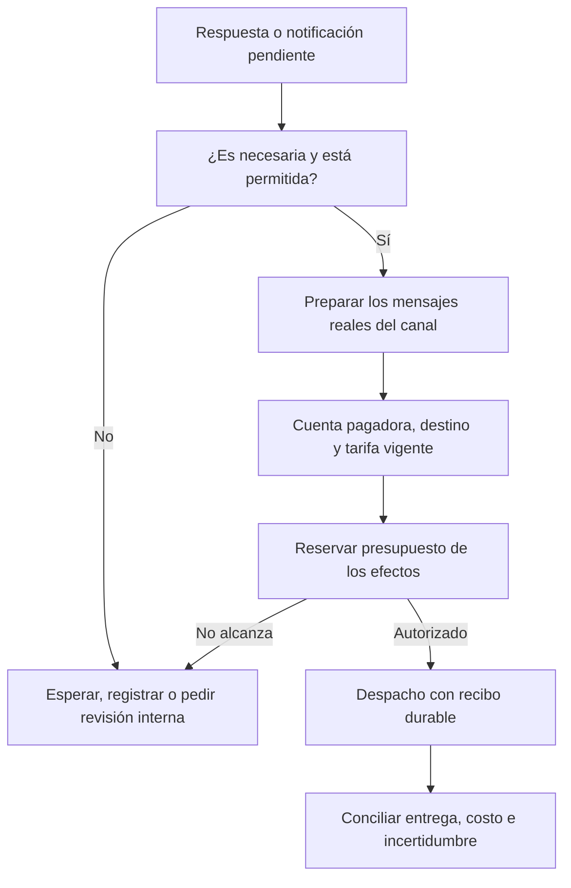

# Protección del gasto en respuestas de WhatsApp

Parallly necesita una política que autorice cada envío de WhatsApp considerando su utilidad, cantidad de entregas y costo en el mercado destinatario. El objetivo es proteger al negocio frente a conversaciones repetitivas, automatizaciones insistentes y abuso, conservando una atención competente. Este frente se añade al plan Meta existente y **no reabre el control del costo de los modelos de IA**.

La política propuesta combina presupuesto monetario, progreso de la tarea, agrupación de mensajes y control de todos los emisores. Una conversación extensa puede ser necesaria; una conversación corta también puede ser cara si se fragmenta en imágenes, enlaces y textos separados. El límite económico debe operar fuera del prompt y antes de transmitir cada efecto.

## 1. Qué cambia y por qué el destino importa

Desde el **1 de octubre de 2026**, Meta anuncia cargos por las respuestas de servicio entregadas, incluidas las producidas por humanos o IA de terceros. El permiso de responder dentro de 24 horas sigue existiendo y no implica gratuidad. La categoría servicio no tiene descuentos por volumen. Los beneficios de cuota y punto de entrada gratuito deben acreditarse con sus condiciones y vigencia; no asumir que todo mensaje orgánico abre una ventana gratuita. Una transferencia a un humano tampoco convierte sus respuestas en gratuitas.[^1]

La tarjeta oficial permite ver la diferencia de una misma cantidad de respuestas. Valores siguientes: **servicio, destino indicado, cuenta facturada en USD**, cuota gratuita agotada, sin FEP, impuestos ni cargos de otro proveedor. No son costos de IA ni tarifas vigentes antes de octubre.[^2]

| Mercado destinatario | USD por respuesta entregada | USD por 20 respuestas cobrables |
|---|---:|---:|
| Colombia | 0,0008 | 0,016 |
| Norteamérica | 0,0034 | 0,068 |
| Brasil | 0,0068 | 0,136 |
| México | 0,0085 | 0,170 |
| España | 0,0200 | 0,400 |
| Argentina | 0,0260 | 0,520 |
| Perú | 0,0300 | 0,600 |
| Países Bajos | 0,0500 | 1,000 |
| Alemania | 0,0550 | 1,100 |

Una respuesta a Alemania cuesta **68,75 veces** la tarifa de Colombia en esa tarjeta USD. Para cuentas COP se usa la tarjeta COP oficial, no una conversión nuestra. Allí, veinte respuestas cobrables a Colombia suman 58,91 COP; a Perú, 2.209,09 COP; a Alemania, 4.049,994 COP, antes de redondeo de presentación. Son cálculos ilustrativos sobre tarifas publicadas, no una factura.[^2]

Por eso tampoco conviene imponer el mismo presupuesto diminuto a cualquier destino: un techo ilustrativo de 1.000 COP admite 339 respuestas colombianas, 9 peruanas o 4 alemanas. Este importe **no es un valor predeterminado recomendado**. Muestra que el negocio debe aprobar una cobertura por mercados y tareas que permita completarlas, además de un techo total que nunca se amplíe automáticamente.

La [matriz reproducible](whatsapp-response-cost-scenarios.json) conserva 47 mercados en cada una de las dos monedas, supuestos, originales y huellas; el [generador](build-whatsapp-response-cost-scenarios.py) permite repetir la aritmética. Es material de planificación: el runtime usará la autoridad tarifaria versionada de M2.

## 2. Qué están planteando los referentes

| Referente | Evidencia relevante para este cambio | Qué adoptar y qué queda sin acreditar |
|---|---|---|
| **Jelou** | Su publicación de julio recomienda reducir turnos por objetivo, usar formularios/Flows/webviews y gestionar la economía por destino.[^3] | Adoptar diseño por tarea y menor fragmentación. Sus recomendaciones y afirmaciones comerciales no acreditan por sí solas una reserva monetaria concurrente por conversación. |
| **respond.io** | Su publicación del 7 de septiembre recomienda consolidar respuestas y aprovechar FEP cuando corresponde. Anuncia tarifa Meta sin markup y una promoción de recargas.[^4] | Adoptar mensajes completos y medir el costo total. El artículo no documenta un tope monetario automático por contacto y destino. |
| **Manychat** | Documenta wallet separado, comprobación de saldo, pausa por insuficiencia y límite de autorrecargas; la documentación citada describe plantillas.[^5] | Adoptar autorización económica previa. No confundir recarga con límite de consumo, ni asumir cobertura de respuestas de octubre o atomicidad no documentada. |
| **Intercom Fin** | Ofrece escalación ante repetición sin nueva información.[^6] | Útil para detectar estancamiento; outcomes y límite de IA no son un presupuesto de mensajes Meta. |
| **Zendesk** | Su constructor impide publicar ciertos bucles de mensajes del bot sin intervención del visitante.[^7] | Añadir comprobaciones estructurales a automatizaciones. Un bucle con respuestas del visitante puede seguir siendo improductivo y cobrable. |

Los límites de créditos IA, contactos activos o iteraciones pertenecen a unidades distintas. Un mismo contacto ya contado puede producir muchos cargos WhatsApp. Las fuentes revisadas no acreditan una protección integral de los referentes contra cualquier gasto por país; eso no prueba que carezcan de controles internos o contractuales. La [evidencia Jelou/respond.io](competitor-jelou-respond-agent-controls.md) y la [comparativa adicional](competitor-agent-guardrails-evidence.md) separan documentación operativa, recomendaciones y límites de cada afirmación.

La respuesta de Parallly debe ser un mecanismo comprobable y una experiencia clara. No publicar superioridad o porcentajes de ahorro tomados de benchmarks comerciales ajenos. Las políticas tarifarias de Meta se verifican en Meta; explicaciones de competidores sobre saldo, crédito o exenciones no se trasladan a nuestra modalidad de pago directo.

## 3. Lo que ya existe y lo que falta en Parallly

El repositorio tiene idempotencia, agrupación de entrada, permisos de herramientas, cierre de operaciones y una infraestructura durable de efectos. Es una base útil. Los siguientes huecos afectan específicamente a los cargos de salida; la [auditoría de código](parallly-conversation-abuse-code-audit.md) conserva revisión, rutas y alcance.

| Hallazgo | Implicación económica | Prioridad |
|---|---|---|
| Una respuesta se expande en textos, links, imágenes y captions separados; el constructor permite hasta 32 efectos | Contar una respuesta del agente como un mensaje subestima WhatsApp | P0 |
| El outbox normal está condicionado por flag; otros emisores llaman rutas directas | Un presupuesto sólo en el flujo del agente deja envíos sin proteger | P0 |
| Nurturing intento 2 encola texto WhatsApp sin pasar por el sender que comprueba baja, ventana y límite diario | Seguimiento innecesario o no permitido, con selección de cuenta que debe corregirse | P0 |
| La respuesta humana y rutas REST/plantillas tienen caminos distintos | Pausar únicamente la IA no protege el presupuesto del canal | P0 |
| El debounce usa tenant/canal/contacto y debe conservar cuenta operativa | Dos números del mismo tenant no deben mezclar mensajes ni pagador | P0 |
| No está acreditada una autoridad general de falta de progreso por objetivo que frene nuevos envíos | El límite de un turno puede reiniciarse indefinidamente | P1 |
| Cerrar o pausar no está demostrado como condición compartida por seguimientos/CSAT/recordatorios | Una automatización puede reabrir el gasto que otra intentó detener | P1 |

La regla universal actual dice **como máximo una pregunta**, no obliga a preguntar siempre. Debe conservarse esa intención y añadir cuándo no hace falta contestar o preguntar más. La vuelta inmediata a una reserva pendiente necesita estado de progreso: no debería repetir el mismo pedido de datos después de que el cliente lo rechazó o no puede resolverlo. No convertir toda charla social breve en abuso.

## 4. Una autorización de envío por efecto real

Todo mensaje cobrable debe atravesar una decisión común, sea originado por agente, humano, campaña, recordatorio, Flow, herramienta, seguimiento, encuesta, REST o prueba operativa. El lugar exacto se integra con M1–M3 y la infraestructura de despacho actual; no se crea una segunda cartera ni se depende sólo del flag de outbox normal.

La unidad de autorización es el efecto que el transporte enviará, después de formar su contenido. La decisión fija tenant, cuenta pagadora, número, destinatario tarifario, categoría, versión tarifaria, objetivo, productor y reserva. Cambiar cualquiera de esos elementos exige revalidación. El cliente o el LLM no puede presentar una supuesta autorización que sustituya esa comprobación.

El presupuesto es **una autorización de gasto**, no dinero custodiado por Parallly: el negocio puede continuar pagando directamente a Meta con su tarjeta. No se necesita convertirnos en BSP financiador para rechazar un envío que exceda lo acordado.

### Jerarquía de límites

1. **Negocio y cuenta:** techo diario/mensual, moneda, reservas vivas, gasto conocido y exposición incierta. Evita que un ataque distribuido agote recursos sin tope.
2. **Contacto:** presupuesto y frecuencia por ventana; no se reinicia al crear otra conversación o decir “hola”. Identidad compartida sólo con evidencia válida; nunca unir personas por nombre.
3. **Objetivo o atención:** techo de gasto y de respuestas, adaptado al recorrido que el negocio ofrece. Una consulta de horario y una modificación compleja de reserva requieren políticas diferentes.
4. **Respuesta/lote:** máximo de efectos permitidos, costo previsto y contenido mínimo útil. Un catálogo no debe disparar veinte fotos sin una decisión de producto y presupuesto.
5. **Mercado/categoría:** alerta de tarifa alta, audiencia comercial autorizada y techo pertinente. Precio por destino, no por idioma del mensaje ni ubicación declarada del negocio.

Añadir un **máximo de tarifa unitaria autorizada por categoría/mercado**: si una actualización o una selección de plantilla supera ese máximo, solicitar revisión del administrador antes de emitir. Un saldo mensual suficiente no autoriza por sí solo cualquier precio por mensaje. Los techos se configuran con la moneda real de la cuenta y se revisan ante cambios tarifarios.

Un límite de cantidad y un límite monetario se aplican juntos: la cuota gratuita también es un recurso que un atacante puede agotar. Los mercados caros no se bloquean por defecto sólo por ser extranjeros. El negocio revisa la propuesta de cobertura, tareas y presupuesto; aumentar un techo requiere un permiso financiero explícito y deja auditoría.

### Costo conservador y concurrencia

Para admitir efectos, la suma de gasto liquidado, reservas comprometidas y exposición pendiente no puede exceder la autorización aplicable. El cálculo debe ser transaccional en PostgreSQL y por la moneda correcta. Una consulta de saldo seguida de un envío sin reserva permite que dos trabajadores gasten el mismo remanente.

Usar precisión decimal suficiente para las tarifas publicadas, sin redondear cada mensaje a pesos o centavos enteros ni mezclar COP y USD. Conservar decimales de cálculo, moneda y redondeo de presentación. Si el cargo real supera la estimación, registrarlo y bloquear nuevo gasto según política; no inventar una liquidación inferior.

La cuota gratuita pertenece al número y período, no a cada destinatario o país. No garantizar costo cero por un contador local si otro proveedor puede consumir el beneficio, si faltan estados o si la entrega puede cruzar la vigencia. Con incertidumbre, reservar el precio completo o una cota conservadora verificable, y liberar al confirmar el beneficio. Esto puede restringir temporalmente más que la factura final; la UI debe explicarlo.

Un timeout no significa que el mensaje no salió. Mantener reserva/exposición y recibo de resultado desconocido; reintentar sólo conforme al ledger existente. Cancelar una tarea local no revierte un mensaje ya aceptado. Conciliar con webhooks, analytics y factura, sin atribuir a cada contacto un costo exacto si sólo hay evidencia agregada.

Si el destino tarifario no está disponible —por ejemplo, una identidad sin teléfono—, no inferirlo del idioma. Usar sólo información oficial soportada; si falta, aplicar una cota configurada para mercados admitidos o pedir revisión. “Desconocido” no puede costar cero por defecto.

## 5. Decidir cuándo otra respuesta aporta valor

La política de progreso determina si conviene producir otro efecto, antes de gastar en WhatsApp. El modelo puede ayudar a interpretar una solicitud, pero el backend conserva los hechos del objetivo: dato solicitado, respuesta aceptada, opciones mostradas, términos presentados, consentimiento, operación pendiente y resultado verificado.

Se considera progreso aportar un dato necesario, resolver una pregunta nueva, cambiar una selección, aclarar una condición, confirmar términos o completar una operación. La negativa del cliente también resuelve una decisión: no se insiste indefinidamente. Hacer otra pregunta o decir “estoy revisando” no prueba progreso.

| Situación | Conducta prevista |
|---|---|
| Pregunta resuelta | Responder con lo necesario; no cerrar siempre con otra pregunta genérica |
| Varios datos enviados juntos | Aprovecharlos; no volver a pedirlos de uno en uno |
| Falta un dato necesario | Pedirlo una vez, en forma clara |
| No entiende la solicitud | Una aclaración distinta o formulario opcional; después vía humana/espera |
| Repite una duda porque nuestra respuesta fue mala | Reparar o derivar; no acusar abuso ni cobrar más preguntas inútiles |
| “Gracias”, reacción o emoji tras tarea terminada | Evitar una nueva ronda automática cuando no hace falta respuesta |
| Nueva necesidad válida tras cierre | Reabrir objetivo conservando los límites acumulados del contacto y cuenta |
| Mismo objetivo sin cambio después de varias rondas | Cambiar estrategia, ofrecer vía humana o esperar; no repetir el mismo texto |
| Contenido fuera del alcance repetido | Una orientación breve como máximo por episodio y luego pausa apropiada |
| Dos bots se retroalimentan o un contacto inunda el canal | Pausar la automatización y registrar alerta interna acotada |

Hipótesis iniciales para ensayos: hasta **dos solicitudes totales del mismo dato sin cambio** (pregunta y reformulación), revisión tras **tres turnos sin progreso** y como máximo **un aviso de pausa por episodio**, siempre presupuestado. Son criterios configurables a validar por tarea, idioma y accesibilidad; no límites productivos ya aprobados. Una solicitud de ayuda humana, una cancelación, un reclamo, una discapacidad o una conversación multilingüe no se clasifica automáticamente como abuso.

La salida de “no responder ahora” debe ser un resultado válido y durable del runtime, no un string vacío que dispare una respuesta de error. Debe explicar internamente por qué se suprimió y permitir una recuperación definida. Nunca marcar como resuelta una operación sólo por silencio o expiración.

## 6. Reducir entregas sin empobrecer la atención

**Agrupar contenido útil.** Una respuesta puede incluir saludo breve, información y enlace en el mismo texto cuando el contrato del canal lo admite. No separar “hola”, “claro”, detalle, precio y “¿algo más?” en cinco mensajes. Agrupar mensajes de entrada cercanos permite contestar la petición completa, respetando orden, cuenta, correcciones y tiempos de respuesta razonables.

Los enlaces canónicos de pago o acción se insertan desde el servidor después de validar su procedencia y destino; no se pide al modelo que los copie o reconstruya para compactar mensajes.

**Usar captions nativos.** El constructor inspeccionado separa captions de imágenes. Ejemplo sintético: un texto, un enlace y tres imágenes con tres captions producen ocho efectos; con enlace dentro del texto y captions nativos compatibles serían cuatro. Para destino Alemania en COP, el ejemplo pasa de 1.619,9976 a 809,9988 COP si todos son cobrables. No es un ahorro medido en producción y depende de límites, contenido y recibos del transporte.[^2]

**Elegir presentación según la tarea.** Mostrar pocos productos pertinentes y un enlace de catálogo puede evitar una galería excesiva. Un Flow o formulario puede recoger varios datos de una vez; su mensaje de apertura, confirmaciones y errores siguen contando cuando generen entregas. No vender Flows como WhatsApp gratuito ni publicar el recorrido antes de que su productor, transporte y verificador estén operativos.

**Ofrecer continuar en Web Chat cuando convenga.** Puede reducir futuras entregas WhatsApp para una tarea larga en un destino caro. Es una opción elegida por el cliente, con contexto e identidad protegidos; el link inicial también puede costar. No imponer un cambio de canal a mitad de una compra ni duplicar luego todas las respuestas por WhatsApp. Los costos de IA y plataforma siguen existiendo.

**Respetar límites del contenido.** Compactar no significa suprimir términos, consentimiento, importes, fechas o advertencias necesarias. Si una operación requiere dos mensajes válidos, se reservan ambos. Nunca recategorizar marketing como servicio/utility, alargar ventanas artificialmente ni omitir confirmaciones de escrituras para ahorrar.

## 7. Pausas, humanos y compromisos ya adquiridos

Al alcanzar un umbral, la plataforma puede registrar la necesidad de intervención en la bandeja sin enviar otro mensaje al cliente. Si se necesita comunicar la pausa por WhatsApp, su costo forma parte de la reserva. Repetir “has alcanzado el límite” a cada mensaje puede ser precisamente el nuevo bucle caro.

Una pausa por gasto debe ser respetada por agente, campañas, nurturing y encuestas; no debe impedir guardar ingresos o recibir confirmaciones de pago. Los humanos ven el costo previsto y la razón del bloqueo. Reanudar o ampliar presupuesto exige el permiso correspondiente y no sucede automáticamente por reasignar la conversación.

Antes de ejecutar una operación que genere una obligación de informar al cliente, reservar también su confirmación mínima y conservarla con los recibos de la operación. Si una escritura ya ocurrió, la nueva política no borra historial, revierte el negocio ni descarta su confirmación durable. Una reserva de recuperación sólo puede consumir una bolsa previamente autorizada, nunca ser una excepción ilimitada.

Si la cuenta de Meta está impaga o no admite más gasto, conservar el pendiente y avisar internamente. No garantizar que una reserva local obligará a Meta a entregar. Al reanudar, verificar tarea, consentimiento, dueño del turno, ventana, destinatario, cuenta y tarifa; no vaciar una cola vieja indiscriminadamente.

Los límites cubren envíos autorizados por Parallly. Si otras apps o proveedores envían desde la misma cuenta, no prometer un techo absoluto sobre toda la factura Meta. Mostrar consumo observado, reservas y cobertura; ampliar alcance sólo con integración y evidencia suficientes.

## 8. Configuración fácil para el negocio

Añadir **“Control de gasto de WhatsApp”** al canal, a Assist y al resumen de activación. Debe mostrar:

- Mercados destinatarios esperados y costo ilustrativo del recorrido habitual en la moneda real de facturación.
- Presupuesto total, presupuesto por atención y comportamiento al alcanzarlo.
- Consumo estimado, confirmado y pendiente, diferenciados de mensajes gratuitos restantes.
- Cantidad de respuestas sin avance y entregas producidas por respuesta, con motivos comprensibles.
- Qué puede pausar, quién puede ampliar un límite y qué envíos externos quedan fuera.

Assist propone valores usando tareas y destinos seleccionados, explica cómo cambiará el servicio y solicita aceptación de la configuración de gasto. No inventar un presupuesto universal a partir del precio del plan ni habilitar ampliaciones automáticas silenciosas. Los controles básicos de abuso, exactitud de cuenta y límite de gasto deben estar en todas las familias de planes; los planes pueden diferenciar capacidad, reportes o gestión, no vender ausencia de protección como economía.

Texto propuesto, publicable después de pruebas: “Define cuánto puede gastar tu negocio en WhatsApp. Parallly controla los envíos que realiza, detecta conversaciones repetitivas y te permite pausar o revisar la atención antes de autorizar más consumo”. Mostrar la cobertura real, sin prometer reducción porcentual ni control sobre cargos de otros sistemas.

## 9. Criterios de aceptación y métricas

El candidato debe superar escenarios con destinos baratos/caros, cuota 999/1000/1001, varios números/países, monedas distintas, cambio septiembre/octubre, media, captions, concurrencia, reinicio, timeout, entrega tardía y modificación de presupuesto. No basta con probar una función aislada que devuelve “denegado”; debe impedir el efecto real por cada productor alcanzable.

Los escenarios semánticos incluyen cliente confundido, varias preguntas útiles, rechazo de oferta, corrección de fecha, mensajes fragmentados, agradecimiento, repetición sin datos nuevos, bot contra bot y solicitud de humano. La política no puede mejorar el gasto declarando fallidas o resueltas tareas que antes completaba. Separar falta de progreso de abuso, y probar los cuatro idiomas.

Métricas principales: costo Meta por tarea efectivamente resuelta; entregas por tarea; entregas sin progreso; efectos por respuesta; falsos bloqueos; tareas abandonadas por límite; tiempo hasta ayuda humana; gasto estimado frente a confirmado; exposición pendiente; emisores sin autorización. Medir ahorro sólo con comparación emparejada de tareas equivalentes y éxito preservado. El silencio nunca prueba resolución.

OWASP reconoce el agotamiento de recursos económicos mediante uso repetido y recomienda cuotas, límites, control de colas y observación. Aplicar esas defensas en la salida evita que cada rechazo origine otra entrega cobrable. Las señales de abuso deben mantener datos mínimos, razones revisables y alcance por tenant.[^8]

## 10. Orden para integrarlo al cierre

| Bloque | Entrega | Dependencia |
|---|---|---|
| **R0** | Inventario de todos los emisores y tarifas por efecto, con evidencia contra HEAD | M0, auditoría de esta carpeta |
| **R1** | Compactación WA, captions/enlaces, aislamiento de debounce y cierre sin respuesta válido | Runtime/despacho existentes |
| **R2** | Progreso por objetivo y pausas compartidas, sin repetir avisos | Autoridad del turno, tools y handoff |
| **R3** | Reserva monetaria por cuenta/contacto/objetivo/mercado para todos los emisores | Reutilizar M1–M3; no segunda cartera |
| **R4** | Corrección nurturing/REST/humano/recordatorios/campañas y recuperación de pendientes | R0–R3, permisos/consentimientos |
| **R5** | UI/Assist, propuesta de presupuesto, simulador por país y pruebas por escenario | L2, cuatro idiomas, plantilla del negocio |
| **R6** | Observación, canario con techo aprobado y criterios de rollback/aceptación | Cierre de release y piloto real autorizado |

La [directiva para Claude](../../handoffs/2026-09-10/claude-whatsapp-response-spend-guardrails.md) contiene las obligaciones de implementación. Se puede cerrar todo el trabajo local con proveedores sintéticos y preparar el piloto. Los presupuestos productivos y su activación se deciden sobre el resultado revisable; las cifras ilustrativas de este documento no autorizan gasto.

## Fuentes

[^1]: Meta, [Upcoming pricing updates for Meta Business Agent, service and utility messages](https://developers.facebook.com/documentation/business-messaging/whatsapp/pricing/non-template-messages/), actualizado 25-ago-2026; original inglés verificado 10-sep-2026. Alcance: servicio entregado, humanos/IA de terceros, ventana, vigencia y ausencia de descuentos de volumen.
[^2]: Meta, [Pricing on the WhatsApp Business Platform](https://developers.facebook.com/documentation/business-messaging/whatsapp/pricing), tarjetas oficiales USD/COP efectivas 1-oct-2026 conservadas en [manifest de fuentes](meta-ratecards-sources.json) y [datos con huellas](meta-ratecards-2026.json), consulta 10-sep-2026. Aritmética propia en `whatsapp-response-cost-scenarios.json`.
[^3]: Jelou, [Nuevos precios de WhatsApp: construye para ganar en la nueva economía de mensajes](https://jelou.ai/en/blog/nuevos-precios-whatsapp), 8-jul-2026. Recomendaciones y afirmaciones del proveedor; no prueba independiente de desempeño ni autoridad tarifaria actual.
[^4]: George Wong / respond.io, [WhatsApp Pricing Change 2026: How Mid-Market B2C Businesses Can Reduce Costs](https://respond.io/blog/whatsapp-pricing-change-2026), 7-sep-2026. Alcance: adaptación comunicada por el proveedor.
[^5]: Manychat, [Manychat Wallet for Email & Message Templates](https://help.manychat.com/hc/en-us/articles/14281283755164-Manychat-Wallet-for-Email-Message-Templates), actualizado 3-dic-2025. Alcance documentado: wallet, plantillas, pausa y autorrecarga; no se asume implementación de octubre.
[^6]: Intercom, [Conversational Fin experience](https://www.intercom.com/help/en/articles/11433030-conversational-fin-experience), 19-jun-2026. Alcance: oferta de escalación ante bucle; no tope Meta.
[^7]: Zendesk, [Publishing errors in AI agents](https://support.zendesk.com/hc/en-us/articles/8357756614426-Publishing-errors-in-AI-agents-Ultimate), actualizado 11-jun-2026. Alcance: validación del constructor.
[^8]: OWASP, [LLM10:2025 Unbounded Consumption](https://genai.owasp.org/llmrisk/llm102025-unbounded-consumption/), edición 2025, consultada 10-sep-2026. Aplicación al despacho WhatsApp es diseño propio de Parallly.
