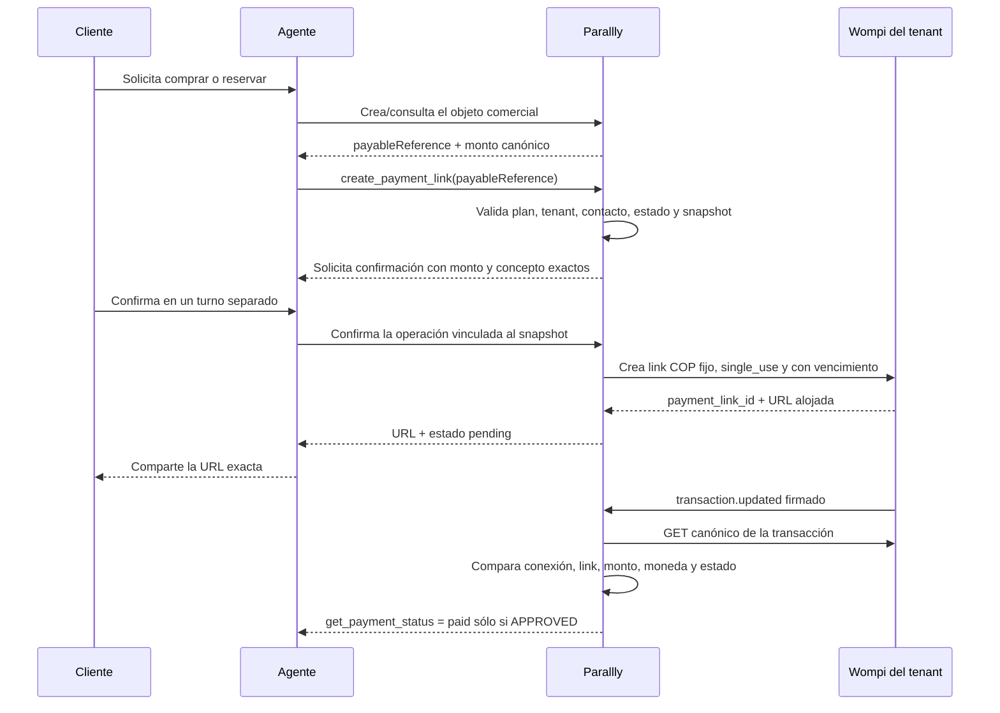

# Cobros del tenant a sus clientes con Wompi

## Alcance

Este riel permite que cada tenant conecte **su propia cuenta Wompi** y cobre
pedidos, reservas, matrículas u otros objetos comerciales creados dentro de
Parallly. El dinero va del cliente final directamente al comercio.

No se reutilizan las llaves Wompi de la plataforma, no se crea una fuente de
pago de suscripción y el ingreso no entra en la facturación Factus/DIAN de
Parallly. Mercado Pago puede seguir conectado como proveedor alternativo del
tenant; el backend elige un único proveedor activo y el modelo de IA nunca lo
escoge.

## Flujo canónico

La redirección del navegador, una captura o la afirmación del cliente no son
prueba de pago. Sólo `APPROVED`, obtenido de la transacción canónica de Wompi,
puede acreditar el objeto.

## Credenciales del tenant

Para Wompi se solicitan y almacenan cifradas:

- ambiente `sandbox` o `production`;
- `public_key`, para validar el comercio y consultar transacciones;
- `private_key`, para crear enlaces de pago;
- `events_secret`, para verificar los eventos.

El `integrity_secret` no es obligatorio en esta fase porque se usa el API de
Links de Pago alojados, no el Widget/Web Checkout ni transacciones directas.
Las claves privadas y de eventos nunca se devuelven al dashboard ni se incluyen
en el contexto del agente. Se guardan en un envelope AES-256-GCM versionado,
autenticado además con tenant, proveedor, ambiente y nombre del campo; copiar un
ciphertext a otra cuenta o ranura no lo hace descifrable. El keyring admite una
clave actual y claves previas durante una rotación. Sandbox y producción no se
pueden mezclar.

Cada conexión obtiene una URL opaca de webhook. Wompi permite configurar una
URL de eventos por ambiente en el comercio; antes de reemplazar una URL
existente, el tenant debe confirmar que no interrumpirá otra integración.

## Enlaces e idempotencia

Los enlaces se crean con monto fijo en COP, `single_use=true`, vencimiento corto
y sin datos personales en nombre, descripción o SKU. El SKU contiene un UUID
opaco de Parallly; la correlación autoritativa usa el `payment_link_id` durable.

Como Wompi no documenta una clave de idempotencia para crear enlaces, Parallly
mantiene una intención local única por versión del objeto cobrable. Un timeout
de resultado desconocido queda `ambiguous`/`requires_review`; no se genera un
segundo enlace a ciegas.

Una intención admite varios intentos de transacción. Eventos duplicados o fuera
de orden son idempotentes. La acreditación del objeto y el ledger se actualizan
en una sola transacción, con transición monotónica. Si dos transacciones
distintas quedan aprobadas para la misma intención, se acredita una sola vez y
se genera una revisión operativa por posible doble cobro. Cualquier integración
secundaria futura —por ejemplo fulfillment externo o automatizaciones— deberá
usar un outbox durable antes de depender de esos eventos.

## Control por plan y por agente

La feature runtime `customerPayments` es independiente de `ecommerce`:

- se puede habilitar o deshabilitar por plan desde el catálogo de planes;
- se valida al guardar/activar credenciales y justo antes de crear el enlace;
- la herramienta sólo se ofrece cuando el plan, la configuración del agente y
  el proveedor activo están listos;
- el agente se configura con `tools.payments.enabled` y
  `tools.payments.canCreateLinks`;
- un downgrade bloquea enlaces nuevos, pero mantiene webhook, conciliación y
  consulta de estados para operaciones existentes.

La herramienta de escritura acepta únicamente `payableReference`. El monto,
moneda, concepto, tenant, contacto y estado cobrable se resuelven en el backend.
`get_payment_status` es lectura y sólo informa el ledger local reconciliado.

## Estados

- `pending`: enlace creado o transacción todavía pendiente;
- `paid`: existe una transacción canónica `APPROVED` y todas las identidades y
  cantidades coinciden;
- `failed`: la creación del enlace falló antes de producir un efecto ambiguo;
- `refunded`: reversión confirmada y registrada;
- `requires_review`: inconsistencia, doble aprobación o resultado ambiguo.

Un intento `DECLINED` o `ERROR` no libera la intención: Wompi permite volver a
intentar sobre el mismo enlace. Tampoco se declara `expired` sólo por el reloj o
porque el enlace figure inactivo. Puede existir una transferencia iniciada o un
`APPROVED` cuyo webhook se perdió; en ese caso la referencia permanece bloqueada
en `requires_review` hasta obtener evidencia canónica o resolución operativa.

No se ofrece reembolso al agente en la primera versión. El contrato público de
Wompi sólo deja clara la anulación para ciertos pagos con tarjeta; otros métodos
requieren operación desde Wompi/soporte hasta que cada flujo sea certificado.

## Firma y conciliación

El webhook Wompi de cada tenant:

1. selecciona la conexión por identificadores opacos de la URL;
2. calcula SHA-256 concatenando, en el orden recibido, los valores listados en
   `signature.properties`, el `timestamp` y el secreto de eventos;
3. exige que `transaction.id` esté entre las propiedades firmadas; estado,
   monto, moneda y link se toman de la consulta canónica, no del cuerpo;
4. persiste el evento antes de responder 200;
5. consulta `GET /v1/transactions/{id}` con la llave pública de esa conexión;
6. compara ambiente, `payment_link_id`, monto, moneda COP y estado;
7. aplica una transición monotónica e idempotente.

Wompi realiza pocos reintentos de eventos. Cuando ya se conoce el identificador
de transacción, la consulta de estado puede volver a leerla canónicamente. Sin
embargo, el contrato documentado de Links de Pago no garantiza enumerar las
transacciones de un enlace: si se pierden todos los eventos antes de conocer un
ID, Parallly conserva la operación en revisión y no emite un segundo enlace. Un
fallo transitorio de persistencia responde 5xx; un duplicado ya persistido puede
responder 200.

## Certificación antes de producción

- Guardar, rotar y desconectar cada proveedor sin revelar secretos.
- Probar bloqueo de plan en configuración, herramienta y efecto final.
- Crear enlace sandbox con monto fijo, URL Wompi y expiración.
- Probar tarjeta aprobada, rechazada, pendiente y reintento del mismo enlace.
- Probar firma alterada, callback token incorrecto, evento duplicado y fuera de
  orden, monto/moneda/link distintos y caída temporal del webhook.
- Verificar consulta canónica cuando se conoce el ID pero no llega el evento y
  el camino de revisión cuando se pierden tanto evento como ID.
- Probar edición/cancelación del objeto después del snapshot.
- Probar downgrade mientras una transacción está pendiente.
- Certificar por separado tarjeta, Nequi, PSE y Bancolombia en la cuenta del
  tenant antes de prometer su disponibilidad; el checkout sólo muestra los
  métodos habilitados por Wompi para ese comercio.

## Referencias oficiales

- [Links de Pago](https://docs.wompi.co/docs/colombia/links-de-pago/)
- [Eventos](https://docs.wompi.co/docs/colombia/eventos/)
- [Transacciones](https://docs.wompi.co/docs/colombia/transacciones/)
- [Ambientes y llaves](https://docs.wompi.co/docs/colombia/ambientes-y-llaves/)
- [Métodos de pago](https://docs.wompi.co/docs/colombia/metodos-de-pago/)
- [Reintentos de pago](https://docs.wompi.co/docs/colombia/reintento-de-pago/)
